**UNIVERSITAS GUNADARMA**

**FAKULTAS ILMU KOMPUTER & TEKNOLOGI INFORMASI**

**PENGEMBANGAN CHATBOT ECOMMERCE JAJANAN PASAR KUE TRADISIONAL BERBASIS WEB MENGGUNAKAN LARAVEL DAN MYSQL**

**Disusun Oleh :**

| Nama | : Rizki Arbiansyah |
| --- | --- |
| NPM | : 11122292 |
| Jurusan | : Sistem Informasi |
| Pembimbing | : Asep Juarna, Dr., Ir., M.Kom |

**Diajukan Guna Melengkapi Sebagian Syarat**

**Dalam Mencapai Gelar Sarjana Strata Satu (S1)**

**JAKARTA**

**2026**

# PERNYATAAN ORISINALITAS DAN PUBLIKASI

Saya yang bertanda tangan di bawah ini,

| Nama : | Rizki Arbiansyah |
| --- | --- |
| NPM : | 11122292 |
| Judul Skripsi : | Pengembangan Chatbot Ecommerce Jajanan Pasar Kue Tradisional Berbasis Web Menggunakan Laravel dan Mysql |
| Tanggal Sidang : |  |
| Tanggal Lulus : |  |

Menyatakan bahwa tulisan ini merupakan hasil karya saya sendiri dan dapat dipublikasikan sepenuhnya oleh Universitas Gunadarma. Segala kutipan dalam bentuk apa pun telah mengikuti kaidah dan etika yang berlaku. Mengenai isi dan tulisan adalah merupakan tanggung jawab penulis, bukan Universitas Gunadarma. Demikian pernyataan ini dibuat dengan sebenarnya dan dengan penuh kesadaran.

Jakarta, tgl bulan 2024

(Rizki Arbiansyah)

# LEMBAR PENGESAHAN

| Judul Skripsi : | Pengembangan Chatbot Ecommerce Jajanan Pasar Kue Tradisional Berbasis Web Menggunakan Laravel dan Mysql |
| --- | --- |
| Nama Mahasiswa : | Rizki Arbiansyah |
| NPM : | 11122292 |
| Tanggal Lulus : |  |

**PANITIA UJIAN**

| **NO** | **NAMA** | **KEDUDUKAN** |
| --- | --- | --- |
| 1. | Dr. Ravi Ahmad Salim | Ketua |
| 2. | Prof. Dr. Wahyudi Priyono | Sekretaris |
| 3. | Dr. Ana Kurniawati, ST., MMSI | Anggota |
| 4. | Dr. Onny Marlen, SKom., MMSI | Anggota |
| 5. | Dr. Rina Noviana, SKom., MM | Anggota |

**Menyetujui,**

| **Pembimbing** | **Bagian Sidang Ujian** |
| --- | --- |
|  |  |
| **(Dr. Ana Kurniawati, ST., MMSI)** | **(Dr. Edi Sukirman, S.Si., MM., M.I.Kom.)** |

# ABSTRAK

Rizki Arbiansyah, 11122292

**PENGEMBANGAN CHATBOT ECOMMERCE JAJANAN PASAR KUE TRADISIONAL BERBASIS WEB MENGGUNAKAN LARAVEL DAN MYSQL**

Skripsi. Jurusan Sistem Informasi, Fakultas Ilmu Komputer dan Teknologi Informasi, Universitas Gunadarma, 2026.

Kata Kunci :

(xvii+jumlah halaman+Lampiran)

Isi abstrak

Daftar Pustaka (tahun awal-tahun akhir)

# ABSTRACT

Rizki Arbiansyah, 11122292

**DEVELOPMENT OF A WEB-BASED TRADITIONAL MARKET SNACK ECOMMERCE CHATBOT USING LARAVEL AND MYSQL**

Thesis. Department of Information Systems, Faculty of Computer Science and Information Technology, Gunadarma University, 2026.

Keywords:

(xvii+number of pages+Appendices)

Bibliography (tahun awal-tahun akhir)

# KATA PENGANTAR

Segala puji dan Syukur penulis panjatkan ke Tuhan Yang Maha Kuasa yang telah memberikan berkat, anugerah dan karunia yang melimpah, sehingga penulis dapat menyelesaikan tugas akhir ini.

Tugas akhir ini disusun guna melengkapi sebagian syarat dalam mencapai gelar Setara Sarjana Satu pada jurusan Sistem Informasi, Fakultas Ilmu Komputer dan Teknologi Informasi, Universitas Gunadarma. Adapun judul skripsi ini Adalah **"** **PENGEMBANGAN CHATBOT ECOMMERCE JAJANAN PASAR KUE TRADISIONAL BERBASIS WEB MENGGUNAKAN LARAVEL DAN MYSQL"**.

Walaupun banyak kesulitan yang penulis harus hadapi ketika menyusun tugas akhir ini, namun berkat bantuan dan dorongan dari berbagai pihak akhirnya tugas ini dapat diselesaikan dengan baik. Untuk itu penulis mengucapkan terima kasih, kepada:

1.  Prof. Dr. E.S. Margianti, SE., MM., selaku Rektor Universitas Gunadarma.
2.  Prof. Dr.rer-nat Achmad Benny Mutiara, selaku Dekan Fakultas Ilmu Komputer dan Teknologi Informasi Universitas Gunadarma.
3.  Dr. Setia Wirawan, SKom., MMSI., selaku Ketua Jurusan Sistem Informasi Fakultas Ilmu Komputer dan Teknologi Informasi Universitas Gunadarma.
4.  Dr. Edi Sukirman, Ssi., M.M., M.I.KOM., selaku Kepala Bagian Sidang Ujian Universitas Gunadarma.
5.  Dr. Ana Kurniawati, ST., MMSI., selaku Dosen Pembimbing yang telah banyak membantu, memberikan bimbingan serta masukan dan mendampingi selama penyusunan tugas akhir ini dengan sabar sampai selesai.
6.  Bapak dan Ibu Dosen Universitas Gunadarma yang telah memberikan banyak ilmu pengetahuan kepada penulis.
7.  pemilik selaku pemilik dari tempat pemilik yang telah memberikan izin usahanya sebagai bahan tugas akhir ini.
8.  Kedua orang tua penulis, yaitu Bapak nama bapak dan Ibu nama ibu yang selalu mendoakan dan mendukung baik dari segi materi maupun moral sehingga menjadi motivasi yang mendorong penulis untuk menyelesaikan tugas akhir ini.
9.  Penulis menyadari dalam penulisan tugas akhir ini banyak kekurangannya. Walaupun penulisan ini jauh dari sempurna, penulis berharap agar penulisan ini bermanfaat dan menambah wawasan bagi pihak-pihak yang membutuhkan. Akhir kata penulis mengharapkan kritik dan saran yang bersifat membangun untuk menjadi perbaikan di masa yang akan mendatang

| Jakarta, tgl bulan 2026 |
| --- |
|  |
| Rizki Arbiansyah |

# DAFTAR ISI

[PERNYATAAN ORISINALITAS DAN PUBLIKASI ii](#_Toc232721189)

[LEMBAR PENGESAHAN iii](#_Toc232721190)

[ABSTRAK iv](#_Toc232721191)

[ABSTRACT v](#_Toc232721192)

[KATA PENGANTAR vi](#_Toc232721193)

[DAFTAR ISI viii](#_Toc232721194)

[DAFTAR TABEL xi](#_Toc232721195)

[DAFTAR GAMBAR xii](#_Toc232721196)

[DAFTAR LAMPIRAN xiii](#_Toc232721197)

[1\. PENDAHULUAN 1](#_Toc232721198)

[1.1 Latar Belakang 1](#_Toc232721199)

[1.2 Rumusan Masalah 2](#_Toc232721200)

[1.3 Tujuan Penelititan 3](#_Toc232721201)

[1.4 Manfaat Penelitian 3](#_Toc232721202)

[1.5 Sistematika Penulisan 4](#_Toc232721203)

[2\. TINJUAN PUSTAKA 5](#_Toc232721204)

[2.1 Jajanan Pasar 5](#_Toc232721205)

[2.2 E-Commerce 5](#_Toc232721206)

[2.3 Website 5](#_Toc232721207)

[2.4 MySQL 6](#_Toc232721208)

[2.5 PHP (Hypertext Preprocessor) 6](#_Toc232721209)

[2.6 Laravel 6](#_Toc232721210)

[2.7 Unified Modeling Language (UML) 7](#_Toc232721211)

[2.7.1 Use Case Diagram 7](#_Toc232721212)

[2.7.2 Class Diagram 8](#_Toc232721213)

[2.7.3 Activity Diagram 10](#_Toc232721214)

[2.8 Struktur Navigasi 11](#_Toc232721215)

[2.8.1 Struktur Navigasi Linier 11](#_Toc232721216)

[2.8.2 Struktur Navigasi Hirarki 12](#_Toc232721217)

[2.8.3 Struktur Navigasi Non-Linier 12](#_Toc232721218)

[2.8.4 Struktur Navigasi Campuran 13](#_Toc232721219)

[2.9 XAMPP 13](#_Toc232721220)

[2.10 HTML (HyperText Markup Language) 14](#_Toc232721221)

[2.11 Visual Studio Code 14](#_Toc232721222)

[2.12 CSS (Cascading Style Sheets) 14](#_Toc232721223)

[2.13 Javascript 15](#_Toc232721224)

[2.14 Pakasir 15](#_Toc232721225)

[2.15 Fonnte 16](#_Toc232721226)

[2.16 Balsamiq 16](#_Toc232721227)

[2.17 Black-box Testing 16](#_Toc232721228)

[2.18 Chatbot 17](#_Toc232721229)

[2.19 Artificial Intelligence (AI) 17](#_Toc232721230)

[2.20 Application Programming Interface (API) 17](#_Toc232721231)

[3\. METODE PENELITIAN 18](#_Toc232721232)

[3.1 Gambaran Umum Penelitian 18](#_Toc232721233)

[3.1.1 Gambaran Umum Website 18](#_Toc232721234)

[3.2 Tahap Perencanaan 21](#_Toc232721235)

[3.2.1 Melakukan Interview 22](#_Toc232721236)

[3.3 Tahap Analisis 23](#_Toc232721237)

[3.3.1 Analisis Masalah 23](#_Toc232721238)

[3.3.2 Analisis Kebutuhan Fungsional 25](#_Toc232721239)

[3.3.3 Analasis Kebutuhan Non Fungsional 27](#_Toc232721240)

[3.4 Tahap Perancangan 29](#_Toc232721241)

[3.4.1 Struktur Navigasi 29](#_Toc232721242)

[3.4.1.1 Struktur Navigasi Admin 30](#_Toc232721243)

[3.4.1.2 Struktur Navigasi Pengguna 30](#_Toc232721244)

[3.4.2 Unified Modeling Language 32](#_Toc232721245)

[3.4.2.1 Use Case Diagram 33](#_Toc232721246)

[3.4.2.2 Activity Diagram 34](#_Toc232721247)

[3.4.2.3 Class Diagram 38](#_Toc232721248)

[3.4.3 Rancangan Database 40](#_Toc232721249)

[3.4.4 Rancangan Tampilan Halaman 56](#_Toc232721250)

[3.4.4.1 Rancangan Halaman Login 56](#_Toc232721251)

# DAFTAR TABEL

[Tabel 2. 1 Simbol Pada Use Case Diagram 7](#_Toc230996411)

[Tabel 2. 2 Simbol Pada Class Diagram 9](#_Toc230996412)

[Tabel 2. 3 Simbol Pada Activity Diagram 10](#_Toc230996413)

[Tabel 3. 1 Daftar Pertanyaan Interview Pemilik Toko Gegares 22](#_Toc230996434)

# DAFTAR GAMBAR

[Gambar 2. 1 Linier 11](#_Toc230996533)

[Gambar 2. 2 Struktur Navigasi Hirarki 12](#_Toc230996534)

[Gambar 2. 3 Struktur Navigasi Non-Linier 12](#_Toc230996535)

[Gambar 2. 4 Struktur Navigasi Campuran 13](#_Toc230996536)

[Gambar 3. 1 Struktur Navigasi Admin 31](#_Toc232724896)

[Gambar 3. 2 Struktur Navigasi Pengguna Tanpa Login 31](#_Toc232724897)

[Gambar 3. 3 Struktur Navigasi User Dengan Login 32](#_Toc232724898)

[Gambar 3. 4 Use Case Diagram 34](#_Toc232724899)

[Gambar 3. 5 Activity Diagram Admin 36](#_Toc232724900)

[Gambar 3. 6 Activity Diagram Pelanggan 38](#_Toc232724901)

[Gambar 3. 7 Class Diagram 40](#_Toc232724902)

[Gambar 3. 8 Rancangan Halaman Login 58](#_Toc232724903)

[Gambar 3. 9 Rancangan Halaman Daftar 59](#_Toc232724904)

# DAFTAR LAMPIRAN

Isi

# PENDAHULUAN

## Latar Belakang

Perkembangan teknologi informasi dan komunikasi telah membawa perubahan signifikan dalam gaya hidup masyarakat, terutama dalam cara bertransaksi. Digitalisasi ekonomi telah mendorong munculnya berbagai platform e-commerce yang memungkinkan konsumen untuk berbelanja tanpa batasan waktu dan tempat. Di tengah arus modernisasi ini, produk kuliner lokal seperti jajanan pasar dan kue tradisional memiliki nilai budaya dan potensi ekonomi yang tinggi. Namun, keterbatasan akses dan strategi pemasaran digital seringkali membuat produk tradisional ini sulit bersaing dengan produk kuliner modern. Platform Gegares hadir sebagai solusi untuk menjembatani kesenjangan tersebut dengan menyediakan wadah khusus bagi penjualan kue tradisional secara daring agar lebih mudah dijangkau oleh masyarakat luas.

Persaingan di industri kuliner yang semakin kompetitif menuntut para pelaku usaha untuk terus berinovasi dalam memberikan layanan terbaik. Kendala utama yang sering dihadapi oleh toko konvensional saat merambah dunia digital adalah keterbatasan sumber daya manusia untuk menangani interaksi pelanggan secara cepat. Pertanyaan yang bersifat repetitif, seperti rincian bahan kue, harga, hingga informasi ketersediaan stok, seringkali tidak terlayani dengan segera jika hanya mengandalkan admin manual. Kecepatan respon menjadi faktor penentu bagi kepuasan pelanggan, di mana keterlambatan dalam memberikan jawaban dapat mengakibatkan hilangnya potensi transaksi dan menurunnya kepercayaan konsumen terhadap platform.

Untuk mengatasi permasalahan efisiensi layanan tersebut, integrasi teknologi Artificial Intelligence (AI) dalam bentuk chatbot menjadi langkah strategis yang sangat relevan. Chatbot mampu bertindak sebagai asisten virtual yang siaga selama 24 jam untuk melayani berbagai pertanyaan pelanggan secara instan dan akurat. Dengan adanya chatbot, beban kerja admin dapat berkurang sehingga pengelolaan operasional lainnya dapat lebih optimal. Selain itu, penggunaan chatbot pada platform Gegares diharapkan dapat memberikan pengalaman belanja yang lebih interaktif dan personal bagi konsumen, sekaligus memperkuat citra merek sebagai toko kue tradisional yang inovatif.

Penggunaan pencarian informasi produk konvensional pada website e-commerce umumnya menggunakan kueri database relasional (SQL Query) dengan metode pencocokan kata kunci (keyword matching) yang kaku. Metode ini memiliki keterbatasan karena tidak mampu memahami variasi bahasa alami pelanggan yang beragam dan tidak terstruktur. Oleh karena itu, penelitian ini menerapkan teknologi Artificial Intelligence (AI) berupa Generative AI (Google Gemini API) yang dipadukan dengan kueri database MySQL. Kombinasi ini memungkinkan asisten virtual (chatbot) untuk memahami maksud (intent) pertanyaan pelanggan secara fleksibel, sekaligus melakukan analisis visual terhadap gambar jajanan pasar tradisional (fitur Snap & Buy) yang tidak dapat diproses menggunakan kueri database konvensional.

Pengembangan sistem e-commerce Gegares ini menggunakan framework Laravel yang dikenal dengan efisiensi, keamanan, dan struktur arsitekturnya yang rapi. Penggunaan Laravel memudahkan dalam mengintegrasikan logika bisnis yang kompleks serta memastikan aplikasi dapat berjalan dengan performa yang optimal. Sementara itu, MySQL digunakan sebagai sistem manajemen basis data untuk mengelola data produk, akun pengguna, dan riwayat transaksi secara terstruktur. Melalui kombinasi teknologi ini, diharapkan dapat tercipta sebuah platform penjualan jajanan pasar yang tidak hanya fungsional secara fitur, tetapi juga handal secara teknis untuk mendukung kelancaran bisnis kue tradisional di era digital.

## Rumusan Masalah

Dalam proses pengembangan website e-commerce jajanan pasar kue tradisional untuk Gegares, beberapa permasalahan muncul yang perlu dibahas oleh penulis agar dapat memandu proses pembuatan dengan baik. Salah satu permasalahan yang muncul adalah bagaimana merencanakan dan menganalisis kebutuhan website e-commerce yang dilengkapi dengan fitur chatbot AI agar sesuai dengan karakteristik dan target pasar Gegares. Dalam hal ini, perlu dipertimbangkan desain antarmuka pengguna serta arsitektur sistem yang dibangun menggunakan framework Laravel dan pengelolaan database dengan MySQL. Pertanyaan yang muncul adalah apakah website dan chatbot yang dibangun dapat responsif dan berfungsi dengan baik menggunakan teknologi tersebut. Selain itu, penulis juga perlu membahas integrasi asisten virtual (chatbot) ke dalam sistem e-commerce Gegares untuk mengoptimalkan efisiensi pelayanan pelanggan. Hal ini mencakup kemampuan chatbot dalam merespons pertanyaan pelanggan terkait katalog produk, harga, hingga informasi operasional secara otomatis selama 24 jam. Integrasi ini penting untuk memastikan bahwa sistem e-commerce dapat berjalan dengan lancar dan memberikan pengalaman belanja yang lebih interaktif sesuai dengan kebutuhan Gegares dan pelanggan. Selain itu, perlu juga dirumuskan bagaimana mengintegrasikan kueri database MySQL dengan model kecerdasan buatan (Gemini AI API) agar chatbot dapat memberikan informasi katalog produk dan status transaksi secara akurat tanpa mengalami kesalahan informasi (*hallucination*).

## Tujuan Penelititan

Penelitian ini bertujuan untuk meningkatkan penjualan dan memperluas jangkauan pemasaran produk jajanan pasar dan kue tradisional melalui platform Gegares. Selain itu, penelitian ini juga berfokus pada memberikan kemudahan bagi pelanggan yang ingin berbelanja dan mencari informasi mengenai kue tradisional secara efisien tanpa batasan waktu dan jarak. Tujuan utama penelitian ini adalah membuat website e-commerce untuk Gegares, mengembangkan website tersebut sebagai sarana penjualan dan promosi secara daring. Website ini akan membantu toko memodernisasi usahanya dan menjangkau target pasar yang lebih luas. Menerapkan fitur chatbot AI yang diintegrasikan ke dalam sistem bertujuan untuk mempermudah proses pelayanan pelanggan, menjadikan komunikasi terkait ketersediaan produk, harga, dan operasional toko menjadi lebih cepat, otomatis, dan tersedia selama 24 jam. Membuat halaman website admin dengan menggunakan framework Laravel dan database MySQL, mengembangkan tampilan admin yang memungkinkan pengelolaan data produk jajanan pasar, data pelanggan, log percakapan asisten virtual, dan transaksi dengan mudah. Website admin ini akan membantu pengelola Gegares dalam memantau dan mengontrol berbagai aspek operasional penjualan secara efektif.

## Manfaat Penelitian

Manfaat dari penelitian ini adalah meningkatkan efisiensi dan produktivitas operasional platform Gegares dengan memperkenalkan sistem e-commerce yang terintegrasi fitur chatbot AI, yang dapat mengoptimalkan proses penjualan, pemasaran produk jajanan pasar, serta pelayanan informasi pelanggan secara otomatis. Selain itu, sistem e-commerce dan keberadaan chatbot yang siaga 24 jam ini juga akan memberikan kemudahan akses bagi pelanggan yang memiliki keterbatasan waktu, memungkinkan pelanggan untuk mendapatkan jawaban instan terkait produk serta berbelanja kue tradisional dengan lebih fleksibel dan nyaman melalui platform online.

## Sistematika Penulisan

Dalam sistematika penulisan ini berupa gambaran umum dalam 5 bab pokok bahasan yang kemudian diuraikan. Pada bab pertama adalah "Pendahuluan" yang membahas latar belakang, rumusan masalah, tujuan penelitian, manfaat penelitian, dan sistematika penulisan. Kemudian, bab dua adalah "Tinjauan Pustaka" yang memberikan gambaran yang meliputi penjelasan teori dan alat-alat yang digunakan dalam pembuatan aplikasi e-commerce dan chatbot pada toko Gegares berbasis website, seperti sistem e-commerce, chatbot AI, website, PHP, framework Laravel, MySQL, HTML, CSS, dan Visual Studio Code. Selanjutnya, bab tiga adalah "Metode Penelitian" yang berisi tentang deskripsi gambaran umum website, perancangan struktur navigasi dan UML, pembuatan database dan rincian tahapan dalam pembuatan atau pengembangan website penjualan online terintegrasi asisten virtual menggunakan metode pengembangan sistem berupa perencanaan, analisis, perancangan, implementasi, dan pengujian. Kemudian, bab empat "Hasil dan Pembahasan" yang berisi hasil rancangan termasuk kelebihan dan kekurangan dari hasil rancangan website e-commerce dan chatbot yang telah dibuat. Terakhir, bab lima adalah "Penutup" berisi kesimpulan berdasarkan hasil pembahasan dari penulisan dan proses perancangan yang telah dilakukan serta terdapat saran yang bertujuan untuk pengembangan website ke depannya.

# TINJUAN PUSTAKA

## Jajanan Pasar

Jajanan pasar merupakan istilah yang digunakan untuk menyebut berbagai jenis makanan atau camilan tradisional yang dijual di pasar atau warung di Indonesia. Jajanan ini dikenal karena keanekaragaman rasa dan keunikannya, serta menjadi bagian integral dari budaya kuliner lokal (Novita & Sundari, 2023). Rasa yang khas dari jajanan pasar sering kali mencerminkan tradisi dan inovasi masyarakat setempat, di mana setiap daerah memiliki jajanan pasar yang berbedabeda sesuai dengan bahan baku dan cita rasanya (Musyaffa et al., 2021). Selain menghadirkan rasa yang menggugah selera, jajanan pasar juga sering kali kaya akan nilai gizi dan ditawarkan dengan harga yang terjangkau, membuatnya sangat populer di kalangan masyarakat (Nasution, 2020).

## E-Commerce

E-commerce, atau perdagangan elektronik, merupakan bentuk transaksi bisnis yang dilakukan secara online melalui internet, mencakup pembelian dan penjualan barang atau jasa. E-Commerce melibatkan pengembangan platform yang dapat memfasilitasi transaksi secara efisien dan aman. Pengembangan website ecommerce bertujuan untuk meningkatkan pemasaran produk dengan menerapkan metode sekuensial linear. Dengan pendekatan ini, perusahaan atau pemilik usaha dapat mengurangi biaya yang dikeluarkan dan meningkatkan efisiensi operasional, serta membuat proses bisnis lebih efektif dibandingkan dengan metode tradisional (Hidayatun et al., 2020).

## Website

Website, atau situs web, dapat didefinisikan sebagai kumpulan halaman web interkoneksi yang terorganisir di dalam satu domain atau subdomain di World Wide Web (WWW). Istilah ini merujuk pada fasilitas internet yang berfungsi sebagai media penyampaian informasi, berisikan teks, gambar, dan video yang menyampaikan berbagai macam informasi kepada pengguna (Meilani et al., 2023).

Ini menunjukkan bahwa website bukan hanya sekedar satu halaman, melainkan sebuah ekosistem dari berbagai halaman yang saling berkaitan dan menyediakan akses informasi kepada penggunanya. Website dapat berupa situs statis, yang kontennya tetap, atau situs dinamis, yang kontennya dapat berubah dan diperbarui secara real-time. (Fuadi & Candra, 2020).

## MySQL

MySQL adalah sebuah sistem manajemen basis data (DBMS) yang menggunakan model relational database management system (RDBMS) yang banyak digunakan di seluruh dunia. Sebagai perangkat lunak sumber terbuka, MySQL memungkinkan pengguna untuk melakukan pengolahan data dengan bahasa Structured Query Language (SQL), yang mendukung berbagai operasi seperti penyimpanan, pengambilan, serta manipulasi data secara efisien (Hidayat et al., 2023; Alifsyah et al., 2023).

## PHP (Hypertext Preprocessor)

PHP (Hypertext Preprocessor) adalah bahasa pemrograman server-side yang sangat populer digunakan dalam pengembangan web (Agustine & Seimahuira, 2023). Sejak diperkenalkan, PHP telah berkembang menjadi alat yang memungkinkan pembuatan situs web yang dinamis dan interaktif. Sebagai bahasa pemrograman sumber terbuka, PHP memberikan fleksibilitas kepada pengembang untuk memodifikasi dan mengembangkan aplikasi yang kompleks sesuai dengan kebutuhan pengguna (Pangestu et al., 2024).

## Laravel

Laravel adalah framework PHP open source yang dirancang untuk memudahkan pengembangan aplikasi web dengan mengikuti arsitektur ModelView-Controller (MVC). Framework ini menawarkan berbagai fitur canggih yang memungkinkan pengembang untuk membangun aplikasi web dengan cepat dan efisien, termasuk routing yang sederhana serta alat untuk autentikasi dan pengelolaan database. Dengan struktur yang bersih dan sintaks yang elegan, Laravel membantu pengembang dalam mempertahankan kode yang terorganisir dan mudah dibaca, sehingga mengurangi waktu pengembangan dan potensi kesalahan. Populer di kalangan komunitas pengembang, Laravel telah menjadi salah satu framework paling banyak digunakan dalam pengembangan aplikasi web di Indonesia maupun secara global. Selain itu, dukungan komunitas dan dokumentasi yang kaya juga menjadi salah satu alasan utama mengapa banyak pengembang memilih Laravel (Sari & Wijanarko, 2020; Melyani et al., 2023).

## Unified Modeling Language (UML)

UML adalah bahasa pemodelan visual yang bersifat umum dan digunakan untuk menspesifikasikan, memvisualisasikan, membangun, dan mendokumentasikan artefak dari sebuah sistem perangkat lunak. UML menyediakan diagram-diagram yang merupakan alat penting dalam pengembangan perangkat lunak, pemodelan sistem, dan desain arsitektur, karena diagram-diagram tersebut memungkinkan representasi visual dari struktur dan perilaku suatu sistem, sehingga memfasilitasi pemahaman dan komunikasi konsep-konsep yang kompleks (Torcal et al., 2024).

### Use Case Diagram

Use Case Diagram merupakan model hasil analisis sistem yang digunakan untuk menggambarkan interaksi antara aktor dengan sistem, serta mendeskripsikan fungsionalitas yang diharapkan dari sistem. Diagram ini memvisualisasikan hubungan antara pengguna dengan berbagai use case atau aktivitas yang dapat dilakukan terhadap sistem (Ramdany et al., 2024).

Tabel 2. 1 Simbol Pada Use Case Diagram

| **Simbol** | **Deskripsi** |
| --- | --- |
| Aktor  
 | Entitas eksternal (manusia, sistem, atau proses lain) yang berinteraksi langsung dengan sistem. Digambarkan dengan ikon orang-orangan (stickman). |
| Use Case  
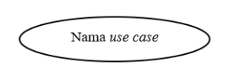 | Fungsionalitas sistem yang dituliskan dalam bentuk kata kerja aktif. Digambarkan dengan bentuk elips. |
| Asosiasi  
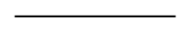 | Garis penghubung antara aktor dan use case yang menunjukkan adanya interaksi atau komunikasi. |
| Include  
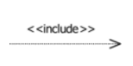 | Hubungan yang menunjukkan bahwa use case tambahan selalu dipanggil oleh use case utama dalam skenario utama. Digambarkan dengan panah bertitik-titik. |
| Extend  
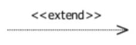 | Hubungan yang menunjukkan bahwa use case tambahan dieksekusi jika dibutuhkan oleh use case utama dalam alur alternatif. |
| Generalisasi  
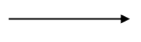 | Relasi antara aktor atau use case yang bersifat hirarki, dari yang umum ke yang khusus. Aktor turunan mewarisi hak akses dari aktor induk. |

### Class Diagram

Class Diagram adalah gambaran struktur sistem yang menunjukkan kelas-kelas yang akan dibangun, lengkap dengan atribut, metode, serta relasi antar kelas seperti asosiasi, generalisasi, dan agregasi. Diagram ini sangat penting dalam mendefinisikan aturan dan tanggung jawab setiap entitas yang ada dalam sistem (Ramdany et al., 2024).

Tabel 2. 2 Simbol Pada Class Diagram

| **Simbol** | **Deskripsi** |
| --- | --- |
| Class  
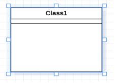 | Mewakili suatu objek dalam sistem yang memiliki atribut dan operasi. Digambarkan sebagai kotak dengan tiga bagian: nama class, atribut, dan metode. |
| Association  
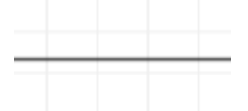 | Menunjukkan hubungan atau interaksi antar class. Digambarkan dengan garis lurus dengan ujung panah terbuka. |
| Aggregation  
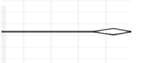 | Menunjukkan hubungan “bagian-dari” yang bersifat longgar, di mana class bagian masih dapat berdiri sendiri. Digambarkan dengan ujung berbentuk belah ketupat kosong. |
| Composition  
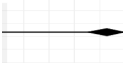 | Hubungan “bagian-dari” yang lebih kuat, di mana class bagian tidak bisa berdiri sendiri tanpa class induknya. Digambarkan dengan belah ketupat berisi (solid). |
| Generalization  
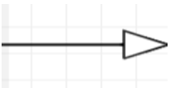 | Hubungan hirarki dari class yang bersifat umum ke class yang lebih spesifik. Digambarkan dengan panah segitiga. |
| Dependency  
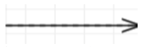 | Menunjukkan bahwa satu class menggunakan class lain dalam operasinya. Digambarkan dengan panah putus-putus. |

### Activity Diagram

Activity Diagram merupakan diagram yang digunakan untuk memodelkan alur kerja atau proses bisnis dalam sistem secara visual. Diagram ini menggambarkan urutan aktivitas, kondisi keputusan, serta alur input-output yang terjadi selama proses berlangsung dalam sistem (Ramdany et al., 2024).

Tabel 2. 3 Simbol Pada Activity Diagram

| **Bentuk Simbol** | **Nama** | **Fungsi** |
| --- | --- | --- |
| 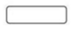 | Activity | Menyatakan bagaimana masing-masing kelas atau aktivitas saling berinteraksi satu sama lain. |
| 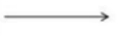 | Control Flow | Menunjukkan urutan eksekusi aktivitas. |
| 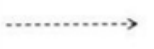 | Object Flow | Menunjukkan aliran objek dari sebuah action atau activity ke action lainnya. |
|  | Start Point | Menyatakan bahwa sebuah objek dibentuk atau diawali. |
|  | End Point | Menyatakan bahwa sebuah objek dibentuk atau diakhiri. |
| 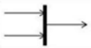 | Join/Penggabungan | Menyatakan untuk meng-gabungkan kembali activity atau action yang parallel. |
| 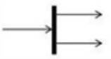 | Fork | Menyatakan untuk memecah behavior menjadi activity atau action yang parallel. |
|  | Decision | Menunjukkan pengambilan suatu keputusan/tindakan yang harus diambil pada kondisi tertentu. |

## Struktur Navigasi

Struktur navigasi adalah susunan atau alur dalam sebuah program yang menggambarkan rancangan hubungan serta aliran kerja antara berbagai bagian yang berbeda. Fungsinya adalah membantu mengatur dan mengorganisasikan seluruh elemen dalam pembuatan sebuah website. Penentuan struktur navigasi sebaiknya dilakukan sebelum proses pembuatan website dimulai. Umumnya, terdapat empat bentuk dasar struktur navigasi yang sering digunakan dalam pengembangan website yaitu struktur navigasi linier, hirarki, non-linier, dan campuran.

### Struktur Navigasi Linier

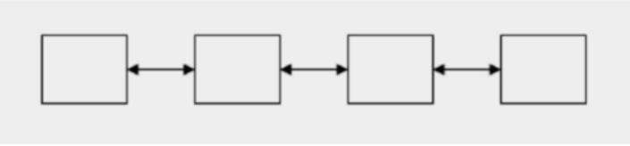

Gambar 2. 1 Linier

Struktur navigasi linier adalah jenis navigasi yang memiliki alur tunggal dan berurutan, di mana tampilan layar disajikan satu per satu sesuai urutannya. Dalam struktur ini, pengguna hanya dapat berpindah ke halaman sebelumnya atau ke halaman berikutnya, tetapi tidak bisa langsung melompat ke dua halaman sebelum atau sesudahnya

### Struktur Navigasi Hirarki

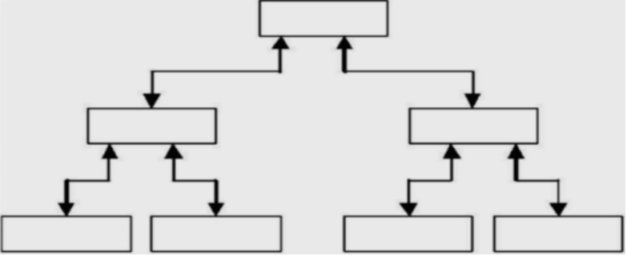

Gambar 2. 2 Struktur Navigasi Hirarki

Struktur navigasi hirarki, atau sering disebut struktur bercabang, adalah jenis navigasi yang menggunakan percabangan untuk menampilkan data sesuai kriteria tertentu. Menu utama pada struktur ini disebut Master Page (halaman utama pertama) dan memiliki halaman turunan yang disebut Slave Page (halaman pendukung). Jika salah satu halaman pendukung dibuka, halaman tersebut akan menjadi Master Page (halaman utama berikutnya), dan proses ini berlanjut seterusnya. Pada jenis navigasi ini, alur linier tidak digunakan.

### Struktur Navigasi Non-Linier

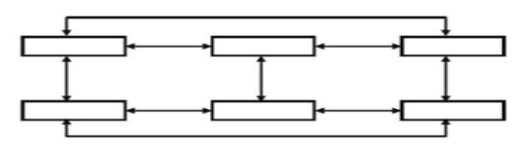

Gambar 2. 3 Struktur Navigasi Non-Linier

Struktur navigasi non-linier adalah pengembangan dari struktur navigasi linier, di mana pengguna dapat membuat navigasi bercabang. Namun, percabangan pada struktur ini berbeda dengan struktur hirarki, karena setiap tampilan memiliki kedudukan yang setara dan tidak ada halaman utama (_Master Page_).

### Struktur Navigasi Campuran

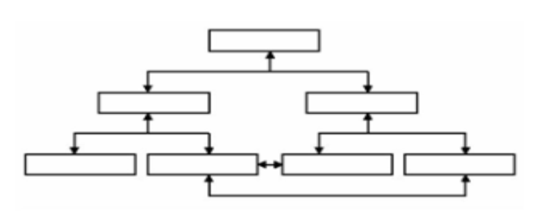

Gambar 2. Struktur Navigasi Campuran

Struktur navigasi composite (campuran) adalah kombinasi dari tiga jenis struktur navigasi yang sudah ada, yaitu linier, hirarki, dan non-linier. Jenis navigasi ini sering digunakan dalam pembuatan multimedia karena mampu memberikan tingkat interaktivitas yang lebih tinggi dan fleksibilitas dalam mengakses informasi. Dengan struktur ini, pengguna dapat dengan mudah memilih jalur navigasi sesuai kebutuhan, sehingga pengalaman penggunaan menjadi lebih dinamis dan menarik.

## XAMPP

XAMPP adalah perangkat lunak yang menyediakan paket instalasi PHP, Apache, dan MySQL yang bertujuan untuk mempermudah pengembangan aplikasi web. Secara khusus, XAMPP adalah program open source yang dirancang agar pengguna dapat menjalankan server lokal di komputer mereka dengan mudah. Dengan dukungan berbagai sistem operasi, XAMPP memungkinkan pengembang untuk menguji aplikasi yang dikembangkan dalam lingkungan yang mirip dengan platform produksi, tanpa perlu konfigurasi yang rumit. Hal ini menjadikan XAMPP pilihan populer bagi banyak pengembang pemula maupun profesional dalam menciptakan aplikasi web yang dinamis dan interaktif. Dukungan terhadap bahasa pemrograman PHP dan sistem manajemen basis data MySQL juga menjadikan XAMPP sebagai alat yang efisien untuk pengembangan aplikasi berbasis web Abdilah & Suparni, 2024).

## HTML (HyperText Markup Language)

HTML (Hypertext Markup Language) adalah bahasa markup standar yang digunakan untuk membuat dan menyusun halaman web. HTML menyusun konten menjadi struktur yang terorganisir, membantu browser menampilkan teks, gambar, dan multimedia lainnya dalam format yang dapat diakses oleh pengguna. Dengan menggunakan tag-tag yang berfungsi sebagai instruksi dalam penulisan dokumen, HTML menjadi dasar dari setiap halaman web yang dapat dipublikasikan di internet. Untuk belajar dan menggunakan HTML dalam pengembangan web, khususnya bagi pengembang pemula, program pelatihan telah dirancang untuk meningkatkan keterampilan peserta dalam membuat website sederhana menggunakan HTML dan teknologi terkait (Jevanda et al., 2023).

## Visual Studio Code

Visual Studio Code (VS Code) adalah editor kode sumber yang dikembangkan oleh Microsoft. VS Code bersifat multiplatform, sehingga dapat dijalankan di berbagai sistem operasi seperti Windows, macOS, dan Linux. Editor ini menawarkan fitur canggih yang mendukung banyak bahasa pemrograman, termasuk JavaScript, TypeScript, dan Python, serta dilengkapi dengan berbagai ekstensi untuk meningkatkan produktivitas pengembang. Salah satu keunggulan VS Code adalah kemampuan untuk mengintegrasikan alat-alat pengembangan lainnya melalui sistem ekstensi, yang memungkinkan para pengembang untuk menyesuaikan lingkungan pengembangan sesuai dengan kebutuhan spesifik proyek mereka. Dengan antarmuka yang ramah pengguna dan dukungan untuk debugging, VS Code telah menjadi salah satu alat favorit di kalangan pengembang perangkat lunak (Bismi et al., 2023).

## CSS (Cascading Style Sheets)

CSS, atau _Cascading Style Sheets_, adalah bahasa stylesheet yang digunakan untuk menggambarkan presentasi visual dari dokumen yang ditulis dalam HTML atau XML. CSS memisahkan konten dari desain dan layout, memungkinkan desainer web untuk mengontrol aspek visual dari sebuah halaman web, termasuk warna, font, jarak, dan tata letak (Ghazali et al., 2024). Dengan menggunakan CSS, pengembang dapat menerapkan tata letak responsif, yang membuat halaman web dapat menyesuaikan tampilan mereka di berbagai perangkat, seperti ponsel, tablet, dan desktop (Riyanto et al., 2022).

## Javascript

JavaScript adalah bahasa pemrograman scripting lintas platform yang sering digunakan dalam pengembangan web untuk meningkatkan fungsionalitas dinamis pada halaman web. Pertama kali dikembangkan untuk menjalankan program di sisi klien dalam browser, JavaScript kini telah meluas penggunaannya ke berbagai bidang, termasuk pemrograman sisi server, basis data, dan Internet of Things (IoT) Shukla (2023). Bahasa ini memungkinkan pengembang untuk menyisipkan logika kompleks, berinteraksi dengan elemen HTML, dan mengubah konten halaman secara dinamis berdasarkan aksi pengguna, seperti klik atau pengisian formulir (Shoikhedbrod, 2023).

## Pakasir

Pakasir adalah platform layanan link pembayaran Indonesia yang memungkinkan merchant menerima pembayaran secara instan tanpa proses aktivasi berhari-hari seperti payment gateway konvensional. Meskipun bukan payment gateway resmi (dana diproses oleh payment gateway mitra), Pakasir memanfaatkan layanan berizin Bank Indonesia untuk membuat link pembayaran yang mendukung QRIS (GoPay, OVO, ShopeePay, Dana), Virtual Account (BNI, BRI, Mandiri, CIMB Niaga, Permata, Maybank), dan e-wallet lainnya. Fungsi utama Pakasir adalah menyediakan link pembayaran dengan aktivasi instan, integrasi mudah, biaya rendah, settlement H+1 pukul 12.00 WIB, serta penarikan dana gratis ke semua bank dan e-wallet Indonesia (PT Geksa, 2024).

Sumber:

PT Geksa. (2024). _Layanan Link Pembayaran - Pakasir_. https://pakasir.com

## Fonnte

Fonnte merupakan sebuah solusi unofficial WhatsApp API gateway yang memanfaatkan antarmuka WhatsApp Web untuk menjalankan berbagai fungsi otomatisasi pengiriman pesan, broadcast massal, auto-reply, dan integrasi API dengan aplikasi atau website tanpa menggunakan layanan resmi dari Meta (Facebook) (ArunaJR, 2025). Meski tidak resmi, Fonnte menawarkan fitur yang cukup lengkap dan mudah digunakan, termasuk dashboard pengelolaan pesan dan webhook untuk notifikasi otomatis seperti pengingat, tagihan, serta pengiriman OTP (Pamela, 2025).

## Figma

Figma adalah alat desain UI/UX berbasis web yang digunakan untuk membuat prototipe aplikasi dengan fitur kolaborasi real-time yang memungkinkan tim bekerja bersama dalam satu file secara bersamaan. Alat ini diaplikasikan dalam metode prototyping untuk pembuatan aplikasi layanan pengadilan yang mencakup proses pengumpulan data, identifikasi masalah, pembuatan alur penggunaan, kerangka kerja, sketsa, dan desain antarmuka akhir. Penggunaan Figma meningkatkan pemahaman terhadap konsep desain UI/UX serta memperkaya kreativitas dan keterampilan teknis dalam mengembangkan prototipe digital. Fungsi utama Figma adalah membuat mockup desain, wireframe, prototyping interaktif, dan komponen reusable untuk pengembangan aplikasi yang efisien (Senubekti et al., 2024)

Sumber:

Senubekti, M. A., Dajoreyta, G. L., & Anggraini, N. (2024). Pembuatan Desain UI/UX dengan Metode Prototyping pada Aplikasi Layanan Pengadilan Negeri Bale Bandung menggunakan Figma. _Jurnal Informatika Terpadu_, _10_(1), 1–10. https://doi.org/10.54914/jit.v10i1.1001

## Black-box Testing

Teknik black-box testing merupakan pendekatan pengujian perangkat lunak yang penting dalam memastikan bahwa aplikasi berfungsi sesuai dengan spesifikasi yang diharapkan tanpa melihat ke dalam kode sumbernya. Metode ini berfokus pada pengujian fungsionalitas perangkat lunak dari perspektif pengguna, di mana pengujian dilakukan berdasarkan input yang diterima dan output yang dihasilkan. Dalam konteks pengujian ini, black-box testing dapat membantu mengidentifikasi berbagai jenis kesalahan, seperti kesalahan fungsional yang tidak sesuai, kesalahan pada antarmuka pengguna, serta masalah performansi (Shadiq et al., 2021).

## Chatbot

Chatbot adalah sistem komputer yang dirancang untuk berinteraksi dengan pengguna melalui medium teks atau suara. Chatbot menggunakan algoritma pemrograman untuk memahami permintaan pengguna dan memberikan respons yang sesuai. Chatbot dapat digunakan dalam berbagai aplikasi, seperti layanan pelanggan, pendidikan, dan hiburan (Mann, 2019).

**Referensi:**

Mann, J. (2019). "The Rise of Chatbots: How Conversational AI is Transforming Customer Service." Journal of Business Research, 102, 1-10. [Link](https://www.sciencedirect.com/science/article/pii/S0148296318301555)

## Artificial Intelligence (AI)

Artificial Intelligence (AI) adalah cabang ilmu pengetahuan yang berfokus pada pengembangan sistem komputer yang dapat melakukan tugas yang sebelumnya hanya dilakukan oleh manusia, seperti belajar, mengevaluasi, dan memecahkan masalah. AI menggunakan berbagai teknik, seperti machine learning, deep learning, dan reasoning untuk membangun sistem yang mampu memaksimalkan performa dalam berbagai aplikasi (Russell & Norvig, 2020).

**Referensi:**

Russell, S., & Norvig, P. (2020). "Artificial Intelligence: A Modern Approach." Pearson. [Link](https://www.pearson.com/us/higher-education/program/Russell-Artificial-Intelligence-A-Modern-Approach-4th-Edition/PGM344667.html)

## Retrieval-Augmented Generation (RAG)

Retrieval-Augmented Generation (RAG) adalah metode yang mengoptimalkan keluaran dari Large Language Model (LLM) dengan memanfaatkan data dari sumber luar (dalam hal ini, database MySQL) sebelum menghasilkan respons. Melalui RAG, sistem chatbot tidak hanya mengandalkan pengetahuan bawaan model AI, melainkan melakukan kueri (retrieval) data riil dari sistem terlebih dahulu (seperti harga produk, stok, dan data pesanan), kemudian menyajikannya sebagai konteks bagi model AI untuk merumuskan jawaban akhir yang faktual dan bebas dari halusinasi data (Lewis et al., 2020).

**Referensi:**

Lewis, P., et al. (2020). "Retrieval-Augmented Generation for Knowledge-Intensive NLP Tasks." Advances in Neural Information Processing Systems, 33, 9459-9474.

## Application Programming Interface (API)

Application Programming Interface (API) adalah sebuah perantara yang memungkinkan dua sistem komputer berkomunikasi dengan satu sama lain. API memungkinkan pengguna atau aplikasi lain untuk mengakses layanan atau data dari sistem yang telah disediakan. API seringkali digunakan dalam pengembangan aplikasi web dan mobile untuk memungkinkan integrasi antar layanan atau data (Rouse, 2021).

**Referensi:**

Rouse, M. (2021). "What is an API? - Definition, Types, and Examples." Techopedia. [Link](https://www.techopedia.com/definition/33265/api)

# METODE PENELITIAN

## Gambaran Umum Penelitian

Penelitian ini dilakukan untuk mengembangkan sebuah sistem e-commerce jajanan pasar tradisional berbasis web yang terintegrasi dengan fitur chatbot AI pada platform Gegares. Sistem ini dirancang untuk membantu proses penjualan, promosi produk, serta meningkatkan pelayanan pelanggan secara otomatis dan efisien. Dalam proses pengembangannya, penelitian menggunakan framework Laravel sebagai backend dan MySQL sebagai sistem manajemen basis data. Selain itu, teknologi chatbot diterapkan untuk memberikan respon otomatis terhadap pertanyaan pelanggan terkait produk, harga, stok, dan informasi pemesanan.

Metode penelitian yang digunakan dalam pengembangan sistem ini adalah metode pengembangan sistem secara bertahap yang meliputi tahap perencanaan, analisis, perancangan, implementasi, dan pengujian. Pada tahap perencanaan dilakukan pengumpulan informasi dan identifikasi kebutuhan sistem melalui wawancara dengan pemilik usaha. Tahap analisis dilakukan untuk mengetahui permasalahan yang terjadi pada sistem penjualan yang berjalan saat ini. Selanjutnya dilakukan proses perancangan antarmuka, struktur navigasi, UML, dan basis data sebelum sistem diimplementasikan menggunakan Laravel dan MySQL. Setelah sistem selesai dibangun, dilakukan pengujian menggunakan metode black-box testing untuk memastikan seluruh fitur berjalan dengan baik sesuai kebutuhan pengguna.

### Gambaran Umum Website

Website yang dikembangkan merupakan sistem e-commerce pemesanan jajanan pasar tradisional bernama Gegares yang dilengkapi dengan fitur AI Chatbot untuk membantu pelayanan pelanggan secara otomatis. Sistem ini dirancang untuk memudahkan proses pemesanan produk, pengelolaan data pelanggan, manajemen produk, transaksi pembayaran, serta pelayanan informasi secara digital baik bagi pelanggan maupun admin toko.

Website dibangun menggunakan framework Laravel 13 sebagai backend dan Livewire untuk mendukung komponen interaktif pada frontend. Data sistem disimpan menggunakan basis data MySQL sebagai media penyimpanan utama. Selain itu, website juga terintegrasi dengan Pakasir sebagai payment gateway untuk mendukung proses pembayaran online dan Fonnte API untuk mendukung pengiriman notifikasi WhatsApp kepada pelanggan.

Sistem ini juga dilengkapi dengan fitur AI Chatbot yang berfungsi sebagai asisten virtual untuk membantu pelanggan mendapatkan informasi secara otomatis terkait produk, harga, stok, metode pembayaran, dan status pesanan. Chatbot dirancang untuk memberikan pelayanan selama 24 jam sehingga pelanggan dapat memperoleh respon dengan lebih cepat tanpa harus menunggu admin membalas pesan secara manual. Fitur AI Chatbot Gegares dirancang secara hybrid menggunakan metode Retrieval-Augmented Generation (RAG). Proses pengolahan jawaban tidak dilakukan secara mandiri oleh AI, melainkan diawali dengan pengambilan data aktual dari database MySQL menggunakan kueri Eloquent ORM di Laravel (untuk mengambil data stok, harga, promo aktif, dan riwayat pesanan pengguna). Data aktual tersebut kemudian digabungkan ke dalam instruksi sistem (system prompt) sebelum dikirimkan ke server Gemini AI API guna menghasilkan respons bahasa alami yang akurat.

Secara umum, website Gegares terdiri dari beberapa halaman utama yang dapat diakses oleh pengguna maupun admin toko, yaitu sebagai berikut:

1.  Login dan Register

Pengguna dapat membuat akun baru (register) dan masuk ke dalam sistem (login) untuk mengakses berbagai fitur seperti keranjang belanja, wishlist, riwayat pesanan, chatbot, ulasan produk, dan profil pengguna.

1.  Profil Pengguna

Pengguna dapat melihat dan mengubah informasi pribadi seperti nama, alamat, nomor telepon, email, password, serta mengelola data akun pengguna.

1.  Halaman Beranda

Halaman utama website menampilkan informasi singkat mengenai Gegares, kategori produk, produk rekomendasi, produk terlaris, pencarian produk, FAQ, serta akses cepat menuju fitur AI Chatbot.

1.  Daftar Produk

Pengguna dapat melihat daftar produk jajanan pasar tradisional lengkap dengan gambar, harga, stok, dan deskripsi produk. Pada halaman ini pengguna juga dapat melakukan pencarian produk, filter kategori, serta menambahkan produk ke keranjang maupun wishlist.

1.  Detail Produk

Halaman detail produk menampilkan informasi lengkap mengenai produk seperti deskripsi, harga, stok, ulasan pelanggan, rating produk, dan rekomendasi produk terkait.

1.  Keranjang Belanja

Pengguna dapat menambahkan, mengurangi jumlah, atau menghapus produk dari keranjang sebelum melanjutkan proses checkout.

1.  Checkout dan Pembayaran

Pengguna dapat melakukan proses pemesanan dengan mengisi alamat pengiriman, memilih metode pembayaran, serta melakukan pembayaran online melalui Pakasir menggunakan berbagai metode pembayaran digital.

1.  Riwayat Pesanan

Pengguna dapat melihat daftar pesanan yang pernah dilakukan, status pemesanan, detail transaksi, serta melakukan pembayaran ulang apabila pembayaran sebelumnya belum berhasil.

1.  Wishlist

Fitur wishlist digunakan untuk menyimpan produk favorit pengguna yang ingin dibeli pada waktu lain.

1.  Ulasan dan Rating Produk

Setelah pesanan selesai, pengguna dapat memberikan ulasan dan rating terhadap produk yang telah dibeli sebagai bentuk penilaian kualitas produk dan pelayanan toko.

1.  AI Chatbot

Fitur AI Chatbot berfungsi untuk membantu pelanggan memperoleh informasi secara otomatis terkait produk, stok, harga, metode pembayaran, status pesanan, dan pertanyaan umum lainnya. Chatbot dirancang agar dapat memberikan respon secara cepat dan membantu meningkatkan kualitas pelayanan pelanggan.

1.  Dashboard Admin

Halaman admin digunakan untuk mengelola data produk, kategori produk, pesanan pelanggan, transaksi pembayaran, data pengguna, ulasan produk, serta memantau aktivitas chatbot dan statistik penjualan website.

Website Gegares dirancang dengan tampilan antarmuka yang sederhana, responsif, dan mudah digunakan oleh berbagai kalangan pengguna. Desain user interface (UI) dibuat modern namun tetap mempertahankan nuansa khas jajanan pasar tradisional melalui penggunaan warna, ikon, dan elemen visual yang sesuai dengan identitas toko Gegares. Dengan adanya sistem ini diharapkan proses penjualan, pelayanan pelanggan, dan pengelolaan usaha dapat berjalan lebih efektif, efisien, dan terintegrasi secara digital.

## Tahap Perencanaan

Tahap perencanaan merupakan tahap awal dalam proses pengembangan website e-commerce Gegares. Pada tahap ini dilakukan identifikasi kebutuhan sistem, pengumpulan informasi terkait proses bisnis yang berjalan, serta penentuan teknologi yang digunakan dalam pengembangan website. Perencanaan dilakukan agar proses pengembangan sistem dapat berjalan sesuai tujuan penelitian dan kebutuhan pengguna.

Dalam tahap ini ditentukan bahwa website akan dibangun menggunakan framework Laravel dengan database MySQL karena dinilai mampu mendukung pengembangan sistem yang terstruktur, aman, dan mudah dikembangkan. Selain itu, dilakukan perencanaan terhadap fitur-fitur utama yang akan diterapkan pada website seperti sistem pemesanan online, pengelolaan produk, integrasi payment gateway, integrasi WhatsApp API, dan chatbot AI untuk pelayanan pelanggan otomatis.

### Melakukan Interview

Pada tahap ini penulis melakukan wawancara secara langsung dengan pemilik usaha Gegares yaitu Ibu Marsiah untuk memperoleh informasi mengenai proses bisnis yang sedang berjalan dan kebutuhan sistem yang akan dikembangkan. Wawancara dilakukan untuk mengetahui kendala yang dihadapi dalam proses penjualan jajanan pasar tradisional, terutama pada proses pemasaran, pelayanan pelanggan, pengelolaan produk, dan transaksi pemesanan.

Analisis terhadap hasil wawancara dilakukan guna menggali pemahaman yang lebih komprehensif terkait kebutuhan sistem. Rincian pertanyaan yang diajukan kepada pemilik toko disajikan pada tabel di bawah ini, sedangkan hasil jawaban lengkapnya dapat dilihat pada bagian lampiran.

Tabel 3. 1 Daftar Pertanyaan Interview Pemilik Toko Gegares

| **No** | **Pertanyaan Kepada Pemilik Toko Gegares** |
| --- | --- |
| 1. | Bagaimana proses penjualan jajanan pasar yang dilakukan saat ini? |
| 2. | Media apa saja yang digunakan untuk menerima pesanan pelanggan? |
| 3. | Apakah terdapat kendala dalam melayani pelanggan secara manual? |
| 4. | Bagaimana proses pencatatan data pesanan dan transaksi saat ini? |
| 5. | Apakah pernah terjadi kesalahan pencatatan pesanan atau stok produk? |
| 6. | Apakah pelanggan sering menanyakan informasi produk yang sama secara berulang? |
| 7. | Apakah Gegares sudah memiliki media promosi online selain WhatsApp? |
| 8. | Fitur apa saja yang diharapkan tersedia pada website Gegares? |
| 9. | Apakah diperlukan sistem pembayaran online pada website? |
| 10. | Apa harapan pemilik usaha terhadap sistem e-commerce dan chatbot yang akan dibangun? |

Interview dilakukan dengan pemilik Toko Gegares, yaitu Ibu Marsiah, untuk memperoleh informasi mengenai proses bisnis yang berjalan, permasalahan yang dihadapi, serta kebutuhan sistem yang akan dikembangkan. Hasil interview digunakan sebagai dasar dalam analisis kebutuhan dan perancangan website Gegares. Adapun daftar pertanyaan dan hasil jawaban interview dapat dilihat pada tabel berikut

Tabel 3. 2 Tabel Hasil Jawaban Interview Pemilik Toko Gegares

| No | Jawaban Pemilik Toko Gegares |
| --- | --- |
| 1 | Proses penjualan masih dilakukan secara manual dengan menerima pesanan pelanggan secara langsung maupun melalui WhatsApp. |
| 2 | Media yang digunakan untuk menerima pesanan adalah WhatsApp dan komunikasi langsung dengan pelanggan di pasar. |
| 3 | Kendala yang sering terjadi adalah keterlambatan membalas pesan pelanggan ketika pesanan sedang banyak dan kesulitan melayani pertanyaan pelanggan secara bersamaan. |
| 4 | Pencatatan pesanan masih dilakukan secara manual sehingga terkadang sulit memantau jumlah pesanan dan transaksi yang masuk. |
| 5 | Pernah terjadi kesalahan pencatatan pesanan dan stok karena data belum tersimpan secara otomatis dalam sistem. |
| 6 | Pelanggan sering menanyakan informasi yang sama seperti harga produk, stok, isi produk, dan jadwal pengiriman. |
| 7 | Saat ini promosi online masih terbatas menggunakan WhatsApp dan media sosial sederhana. |
| 8 | Pemilik usaha menginginkan fitur katalog produk, pemesanan online, pembayaran online, chatbot otomatis, dan pengelolaan data produk serta transaksi. |
| 9 | Ya, diperlukan sistem pembayaran online agar pelanggan lebih mudah melakukan transaksi tanpa harus transfer manual dan konfirmasi secara terpisah. |
| 10 | Harapan pemilik usaha adalah agar website dapat membantu meningkatkan penjualan, mempermudah pengelolaan pesanan, serta mempercepat pelayanan pelanggan melalui chatbot otomatis selama 24 jam |

Berdasarkan hasil wawancara tersebut, diketahui bahwa proses pemesanan masih dilakukan secara manual melalui WhatsApp sehingga sering terjadi keterlambatan respon terhadap pelanggan. Selain itu, proses pencatatan pesanan dan pengelolaan data produk masih belum terstruktur dengan baik sehingga menyulitkan pemilik usaha dalam mengelola transaksi dan stok produk. Oleh karena itu, diperlukan sebuah sistem e-commerce berbasis web yang dapat membantu proses penjualan secara online dan meningkatkan efisiensi pelayanan pelanggan melalui integrasi chatbot AI.

## Tahap Analisis

Tahap analisis dilakukan untuk mempelajari dan memahami kebutuhan sistem berdasarkan hasil wawancara dan observasi terhadap proses bisnis yang sedang berjalan pada Gegares. Pada tahap ini dilakukan identifikasi masalah, analisis kebutuhan pengguna, serta analisis fitur yang akan diterapkan pada website e-commerce dan chatbot AI.

Hasil analisis digunakan sebagai dasar dalam proses perancangan sistem agar website yang dikembangkan dapat sesuai dengan kebutuhan pengguna dan mampu menyelesaikan permasalahan yang ada. Analisis dilakukan terhadap proses pemesanan, pengelolaan produk, pelayanan pelanggan, dan proses transaksi yang berjalan secara manual sebelumnya.

### Analisis Masalah

Analisis masalah dilakukan untuk mengidentifikasi berbagai permasalahan yang dihadapi oleh Toko Gegares dalam proses penjualan dan pelayanan pelanggan yang masih dilakukan secara manual. Berdasarkan hasil observasi dan wawancara dengan pemilik usaha, permasalahan-permasalahan yang ditemukan dirangkum sebagai berikut:

1.  Proses Pemesanan Masih Dilakukan Secara Manual

Proses pemesanan produk jajanan pasar pada Toko Gegares masih dilakukan melalui WhatsApp dan komunikasi langsung dengan pelanggan. Seluruh proses pencatatan pesanan dilakukan secara manual sehingga proses pelayanan menjadi kurang efektif ketika jumlah pelanggan meningkat. Kondisi ini menyebabkan proses pengelolaan pesanan menjadi lambat dan berisiko terjadinya kesalahan pencatatan data pesanan.

1.  Keterlambatan Pelayanan Pelanggan

Pemilik usaha mengalami kesulitan dalam melayani banyak pelanggan secara bersamaan karena seluruh pertanyaan pelanggan dijawab secara manual. Pelanggan sering menanyakan informasi yang sama seperti harga produk, stok produk, isi produk, dan jadwal pengiriman. Hal tersebut menyebabkan keterlambatan respon pelanggan terutama ketika jumlah pesan yang masuk sedang banyak sehingga dapat menurunkan kepuasan pelanggan.

1.  Pengelolaan Data Transaksi dan Stok Belum Terintegrasi

Pengelolaan data transaksi dan stok produk masih dilakukan secara sederhana tanpa adanya sistem terintegrasi. Data pesanan dan stok produk belum tersimpan secara otomatis sehingga pemilik usaha mengalami kesulitan dalam memantau jumlah transaksi dan ketersediaan produk. Selain itu, kondisi tersebut juga berisiko menyebabkan kehilangan data maupun ketidaksesuaian antara stok produk dan jumlah pesanan pelanggan.

1.  Keterbatasan Media Promosi dan Penjualan

Proses pemasaran produk Gegares masih terbatas menggunakan WhatsApp dan media sosial sederhana sehingga jangkauan pemasaran produk belum optimal. Pelanggan yang ingin melihat daftar produk harus menanyakan langsung kepada penjual karena belum tersedia katalog produk berbasis web yang dapat diakses secara online kapan saja.

1.  Belum Tersedianya Sistem Pelayanan Otomatis

Toko Gegares belum memiliki sistem chatbot atau layanan otomatis yang dapat membantu pelanggan memperoleh informasi secara cepat. Seluruh proses komunikasi masih dilakukan secara manual oleh pemilik usaha sehingga pelayanan pelanggan hanya dapat dilakukan ketika admin sedang aktif. Hal ini menyebabkan pelayanan belum dapat berjalan secara maksimal selama 24 jam.

Berdasarkan permasalahan tersebut, diperlukan sebuah sistem e-commerce berbasis web yang mampu membantu proses pemesanan, pengelolaan data produk, transaksi, dan pelayanan pelanggan secara terkomputerisasi. Selain itu, integrasi chatbot AI diharapkan dapat membantu memberikan respon otomatis kepada pelanggan sehingga pelayanan menjadi lebih cepat, efektif, dan efisien.

### Analisis Kebutuhan Fungsional

Analisis kebutuhan fungsional merupakan tahap penting dalam pengembangan sistem yang bertujuan untuk menentukan fitur dan fungsi utama yang harus tersedia agar sistem dapat berjalan sesuai kebutuhan pengguna. Pada penelitian ini, analisis kebutuhan fungsional dilakukan dengan mengidentifikasi kebutuhan pengguna baik dari sisi pelanggan maupun pemilik toko Gegares, serta menentukan fungsi-fungsi yang diperlukan dalam mendukung proses penjualan jajanan pasar tradisional berbasis web yang terintegrasi dengan AI Chatbot.

Berdasarkan hasil analisis dan pemetaan interaksi sistem melalui use case diagram, kebutuhan fungsional sistem dibagi menjadi dua kategori utama yaitu fungsi untuk pelanggan dan fungsi untuk admin atau pemilik toko:

1\. Fungsi untuk Pelanggan (User)

-   1.  Registrasi & Login Akun: Pelanggan dapat mendaftar dan melakukan login ke sistem untuk mengakses fitur pesanan, wishlist, riwayat transaksi, dan chatbot.
    2.  Menjelajahi Produk: Pelanggan dapat mencari produk berdasarkan kata kunci atau kategori tertentu untuk mempermudah pencarian jajanan pasar.
    3.  Mengelola Wishlist: Pelanggan dapat menyimpan produk jajanan favorit ke dalam daftar keinginan.
    4.  Mengelola Keranjang: Belanja Pelanggan dapat menambah, mengurangi, atau menghapus produk di keranjang belanja sebelum melakukan pembelian.
    5.  Checkout Pesanan: Pelanggan dapat memproses pesanan jajanan pasar, yang secara sistem wajib mencakup:
    

1.  Pilih Alamat: Memasukkan alamat pengiriman.
2.  Pilih Kurir & Ongkir: Menghitung ongkos kirim secara real-time via Biteship.
3.  Bayar Tagihan: Memproses pembayaran secara online terintegrasi Pakasir.
4.  Gunakan Kupon Promo: Untuk memasukkan kode diskon opsional.
    
    1.  Lacak Pengiriman: Pelanggan dapat memantau pergerakan kurir pengiriman Biteship secara real-time di halaman pesanan.
    2.  Selesaikan Pesanan: Pelanggan dapat melakukan konfirmasi bahwa pesanan telah diterima dengan baik .
    3.  Berikan Ulasan: Pelanggan dapat memberikan rating bintang, komentar teks, dan unggah foto produk jajanan, yang merupakan perluasan opsional setelah melakukan Selesaikan Pesanan.
    4.  Tanya AI Chatbot: Pelanggan dapat berinteraksi dengan asisten virtual untuk mendapatkan informasi seputar produk, harga, stok, maupun status pesanan secara otomatis selama 24 jam.
    

2\. Fungsi untuk Admin atau Pemilik Toko

-   1.  Login Admin: Admin dapat melakukan otentikasi login khusus untuk mengamankan akses ke halaman manajemen.
    2.  Kelola Produk Admin: dapat mengelola data jajanan pasar, yang secara sistem wajib mencakup:
    3.  Kelola Kategori Admin: dapat mengelola nama kategori, deskripsi, foto, dan visibilitas kategori produk.
    4.  Kelola Pesanan Admin: dapat memantau pesanan masuk, mengunduh laporan penjualan, dan melakukan filter tanggal/status bayar.
    5.  Proses Pengiriman Admin: dapat mengirimkan permintaan pengantaran (request pickup) ke kurir Biteship.
    6.  Moderasi Ulasan Admin: dapat menyetujui ulasan pelanggan agar tampil di website atau menghapus ulasan spam. Admin juga dapat memperluas tindakan dengan melihat detail foto ulasan melalui fitur Lihat Zoom Foto.
    7.  Kelola Kupon Promo Admin: dapat menambahkan, mengedit, atau menonaktifkan kupon potongan harga.
    8.  Kelola Pengguna Admin: dapat melihat dan mengelola data pelanggan terdaftar.
    9.  Pantau Aktivitas & Chatbot Admin: dapat memantau logs aktivitas operasional sistem serta mengawasi aktivitas AI Chatbot yang sedang berjalan.
    

### Analasis Kebutuhan Non Fungsional

Analisis kebutuhan non fungsional merupakan tahap yang berfokus pada kebutuhan pendukung sistem yang berkaitan dengan kualitas, performa, keamanan, dan kemudahan penggunaan sistem. Dalam pengembangan website e-commerce Gegares berbasis web yang terintegrasi dengan AI Chatbot, kebutuhan non fungsional sangat penting untuk memastikan sistem dapat berjalan secara stabil, aman, responsif, dan mudah digunakan oleh pelanggan maupun admin toko.

Kebutuhan non fungsional pada sistem ini mencakup kebutuhan perangkat keras (hardware), perangkat lunak (software) dan keamanan sistem.

1\. Analisis Kebutuhan Perangkat Keras (Hardware)

Pengembangan dan pengujian website Gegares dilakukan menggunakan perangkat keras dengan spesifikasi sebagai berikut:

-   1.  Prosesor : Intel(R) Core(TM) i5-3470 CPU @ 3.20 GHz
    2.  RAM : 16 GB
    3.  Media Penyimpanan : 512 GB SSD
    4.  Kartu Grafis : NVIDIA GeForce GTX 750 Ti 2 GB
    

Spesifikasi perangkat keras tersebut dinilai cukup untuk mendukung proses pengembangan dan pengujian sistem berbasis web menggunakan Laravel 13, database MySQL, AI Chatbot, serta integrasi API seperti Pakasir dan Fonnte. Selain itu, perangkat tersebut juga mampu menjalankan web server lokal, browser, dan editor kode secara bersamaan dengan performa yang stabil.

2\. Analisis Kebutuhan Perangkat Lunak (Software)

Perangkat lunak yang digunakan dalam pengembangan website Gegares adalah sebagai berikut:

-   1.  Sistem operasi yang digunakan adalah Windows 10 Pro.
    2.  Web server lokal menggunakan XAMPP yang mencakup Apache, MySQL, dan PHP.
    3.  Bahasa pemrograman utama yang digunakan adalah PHP versi 8.x.
    4.  Framework yang digunakan dalam pengembangan sistem adalah Laravel 13.
    5.  Sistem basis data menggunakan MySQL untuk menyimpan data pengguna, produk, transaksi, dan data chatbot
    6.  Livewire digunakan untuk mendukung tampilan website yang lebih interaktif tanpa perlu melakukan reload halaman secara penuh.
    7.  Editor kode yang digunakan adalah Visual Studio Code untuk menulis dan mengelola source code program.
    8.  Browser seperti Google Chrome dan Microsoft Edge digunakan untuk menjalankan serta menguji tampilan website pada berbagai kondisi perangkat.
    9.  Sistem pembayaran online menggunakan layanan payment gateway Pakasir yang terintegrasi melalui API.
    10.  Sistem notifikasi WhatsApp menggunakan layanan API Fonnte untuk mendukung pengiriman pesan otomatis kepada pelanggan.
    11.  Sistem AI Chatbot digunakan untuk membantu pelayanan pelanggan secara otomatis dalam memberikan informasi terkait produk, pembayaran, dan status pesanan.
    

3\. Analisis Keamanan Sistem

Keamanan sistem merupakan aspek penting dalam pengembangan website e-commerce Gegares karena sistem menyimpan data pelanggan, transaksi, dan informasi pembayaran. Oleh karena itu, sistem dirancang dengan beberapa mekanisme keamanan seperti:

1.  Penggunaan sistem autentikasi login dan register untuk membatasi akses pengguna.
2.  Password pengguna disimpan menggunakan metode hashing agar lebih aman.
3.  Validasi input data dilakukan untuk mencegah kesalahan input dan serangan terhadap sistem.
4.  Penggunaan token keamanan pada proses autentikasi dan transaksi data.
5.  Hak akses dibedakan antara pelanggan dan admin untuk menjaga keamanan data sistem.

## Tahap Perancangan

Tahap perancangan merupakan proses pembuatan rancangan sistem berdasarkan hasil analisis kebutuhan yang telah dilakukan sebelumnya. Pada tahap ini dilakukan perancangan struktur navigasi, desain antarmuka pengguna (user interface), Unified Modeling Language (UML), serta perancangan basis data yang akan digunakan pada website Gegares. Tujuan dari tahap perancangan ini adalah untuk memberikan gambaran mengenai alur kerja sistem dan hubungan antar fitur sehingga proses pengembangan website e-commerce berbasis Laravel 13 yang terintegrasi dengan AI Chatbot dapat berjalan secara terstruktur dan sesuai dengan kebutuhan pengguna.

### Struktur Navigasi

Struktur navigasi merupakan gambaran hubungan antar halaman yang terdapat dalam website serta alur perpindahan pengguna ketika mengakses sistem. Pada website Gegares, struktur navigasi dirancang menggunakan model hirarki untuk memudahkan pengguna dalam menemukan informasi dan menggunakan fitur yang tersedia. Struktur navigasi dibedakan berdasarkan hak akses pengguna, yaitu pengguna yang belum login, pengguna yang telah login, dan admin. Perancangan struktur navigasi ini bertujuan untuk menciptakan alur penggunaan yang terorganisir, mudah dipahami, serta memberikan pengalaman pengguna yang lebih efektif dalam mengakses berbagai fitur pada website Gegares.

#### Struktur Navigasi Admin

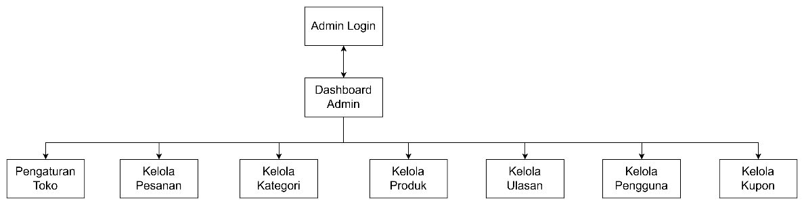

Gambar 3. 1 Struktur Navigasi Admin

Struktur navigasi admin pada website Gegares dimulai dengan halaman Admin Login sebagai pintu autentikasi sebelum memasuki sistem, lalu setelah berhasil masuk admin diarahkan ke Dashboard Admin yang menjadi pusat pengelolaan, dari dashboard ini admin dapat membuka menu utama seperti Pengaturan Toko untuk mengelola info dan konfigurasi situs, Kelola Pesanan untuk memantau serta memperbarui status transaksi pelanggan, Kelola Kategori dan Kelola Produk untuk mengatur data kategori dan barang, Kelola Ulasan untuk mengawasi masukan pelanggan, Kelola Pengguna untuk mengelola akun terdaftar, serta Kelola Kupon untuk membuat dan menata kupon diskon, sehingga keseluruhan navigasi memudahkan pengelolaan aktivitas operasional website secara terpusat dan terorganisir.

#### Struktur Navigasi Pengguna

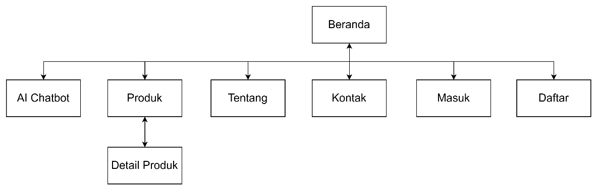

Gambar 3. 2 Struktur Navigasi Pengguna Tanpa Login

Struktur navigasi pengguna yang belum melakukan login (tamu) pada website Gegares menggunakan struktur navigasi hierarkis, di mana halaman Beranda berperan sebagai halaman utama (master page) yang menjadi pusat akses menuju fungsionalitas lainnya. Dari halaman Beranda, pengguna dapat mengakses beberapa menu utama yaitu AI Chatbot, Produk, Tentang, Kontak, Masuk, dan Daftar. Menu AI Chatbot menyediakan akses interaktif bagi pengguna umum untuk menanyakan informasi umum seputar produk dan layanan toko. Pada menu Produk, pengguna dapat menjelajahi daftar katalog jajanan pasar tradisional yang tersedia dan dapat menavigasi secara timbal balik menuju halaman Detail Produk untuk memperoleh deskripsi produk secara rinci. Menu Tentang menyajikan informasi profil, visi, dan misi Toko Gegares, sedangkan menu Kontak memuat saluran komunikasi yang dapat digunakan untuk menghubungi pihak toko secara dua arah.

Selain itu, tersedia menu Masuk bagi pengguna yang telah memiliki akun dan menu Daftar bagi pengguna yang ingin melakukan registrasi akun baru. Penerapan struktur navigasi hierarkis ini menjamin pengguna umum dapat mengeksplorasi informasi produk secara terorganisasi dan interaktif sebelum melakukan otentikasi login ke dalam sistem.

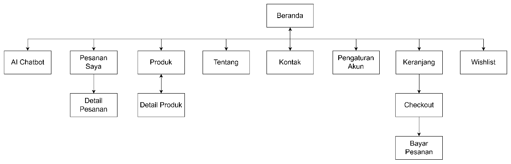

Gambar 3. 3 Struktur Navigasi User Dengan Login

Struktur navigasi pengguna yang telah melakukan login pada website Gegares menggunakan struktur navigasi hierarki dengan halaman Beranda sebagai halaman utama. Setelah berhasil login, pengguna memperoleh akses ke lebih banyak fitur dibandingkan pengguna yang belum login. Dari halaman Beranda, pengguna dapat mengakses menu AI Chatbot, Pesanan Saya, Produk, Tentang, Kontak, Pengaturan Akun, Keranjang, dan Wishlist. Menu AI Chatbot menyediakan asisten virtual interaktif untuk menanyakan informasi seputar produk dan layanan toko. Pada menu Produk, pengguna dapat melihat daftar produk yang tersedia dan mengakses halaman Detail Produk secara timbal balik untuk melihat informasi lengkap mengenai produk yang dipilih. Menu Keranjang digunakan untuk mengelola produk yang akan dibeli, kemudian pengguna dapat melanjutkan ke halaman Checkout dan Bayar Pesanan untuk menyelesaikan proses transaksi.

Selain itu, pengguna dapat mengakses menu Pesanan Saya untuk melihat daftar pesanan yang telah dilakukan dan membuka halaman Detail Pesanan guna memantau status serta informasi transaksi secara lebih rinci. Menu Pengaturan Akun berfungsi untuk mengelola data profil pengguna, sedangkan menu Wishlist digunakan untuk menyimpan produk favorit yang ingin dibeli di kemudian hari. Struktur navigasi ini dirancang untuk memudahkan pengguna dalam melakukan pemesanan, mengelola akun, serta memantau transaksi secara terorganisir melalui satu sistem yang terintegrasi.

### Unified Modeling Language

Unified Modeling Language (UML) merupakan bahasa pemodelan standar yang digunakan untuk menggambarkan dan merancang sistem secara visual sebelum proses implementasi dilakukan. Pada penelitian ini, UML digunakan untuk memodelkan website e-commerce Gegares yang terintegrasi dengan AI Chatbot agar kebutuhan sistem, alur proses, interaksi pengguna dengan sistem, serta struktur data dapat digambarkan dengan jelas. Diagram UML yang digunakan meliputi Use Case Diagram, Activity Diagram, Sequence Diagram, dan Class Diagram, yang masing-masing berfungsi untuk menggambarkan kebutuhan fungsional, alur aktivitas, interaksi antar objek, serta struktur kelas pada sistem yang akan dikembangkan.

#### Use Case Diagram

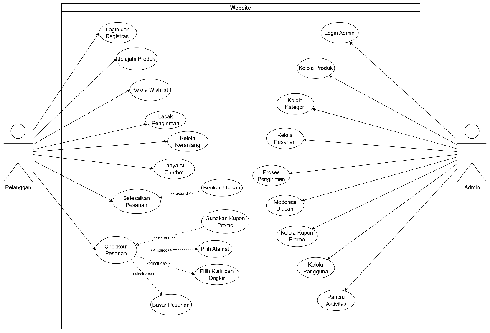

Gambar 3. 4 Use Case Diagram

Use case diagram pada sistem pemesanan jajanan pasar tradisional berbasis web di Toko Gegares menggambarkan interaksi Pelanggan dengan sistem. Pelanggan dapat mendaftar dan login ke dalam akun, menjelajahi katalog produk, mengelola wishlist untuk produk favorit, memantau keranjang belanja, melacak status pengiriman, serta dapat berinteraksi dengan Tanya AI Chatbot untuk memperoleh informasi otomatis terkait produk atau transaksi. Selain itu, Pelanggan dapat melakukan checkout pesanan yang selalu mencakup (include) pemilihan alamat pengiriman, pemilihan kurir/ongkos kirim, dan pembayaran pesanan secara online, yang dapat diperluas (extend) dengan penggunaan kupon promo, serta dapat melakukan penyelesaian pesanan yang diperluas (extend) dengan memberikan ulasan produk.

Admin bertindak sebagai pengelola internal sistem yang memiliki hak akses khusus untuk mengelola login admin, produk, kategori produk, kupon promo, dan data pengguna. Admin juga bertanggung jawab atas pengelolaan operasional transaksi seperti memproses pengiriman pesanan, memoderasi ulasan yang masuk dari pelanggan, serta memantau seluruh log aktivitas sistem.

Secara keseluruhan, diagram ini menunjukkan pembagian peran yang jelas di mana Pelanggan berfokus pada aktivitas transaksi pembelian dan pencarian informasi secara interaktif melalui chatbot, sedangkan Admin berfokus pada manajemen, pemrosesan transaksi, dan pemeliharaan operasional website.

#### Activity Diagram

Activity diagram merupakan diagram yang menggambarkan aliran kerja (workflow) atau aktivitas dari suatu sistem, mulai dari awal aktivitas, keputusan (decision) yang mungkin terjadi, hingga akhir dari aktivitas tersebut. Diagram ini digunakan untuk memodelkan proses bisnis dan mendokumentasikan interaksi dinamis antara pengguna (actor) dengan sistem Gegares. Melalui activity diagram, dapat diidentifikasi bagaimana sistem merespons setiap aksi yang dilakukan oleh aktor secara berurutan.

Pada sistem E-Commerce Gegares, activity diagram dibagi menjadi beberapa bagian utama berdasarkan peran aktor yang berinteraksi dengan sistem, yaitu Activity Diagram untuk Admin (pengelola sistem) dan Activity Diagram untuk Pelanggan (pengguna umum/tamu maupun pelanggan terdaftar).

##### Activity Diagram Admin

Activity diagram Admin menggambarkan secara komprehensif alur aktivitas serta urutan interaksi dinamis yang dilakukan oleh Aktor Admin dalam mengelola data operasional pada sistem e-commerce Gegares. Proses interaksi ini diawali dengan tahapan autentikasi masuk ke dalam sistem (login) guna memastikan aspek keamanan hak akses pengelola. Setelah berhasil terverifikasi, alur berlanjut pada pengelolaan berbagai fitur utama operasional dan administrasi sistem melalui halaman Dasbor Admin. Pengelolaan menu-menu operasional ini dimodelkan menggunakan mekanisme bilah sinkronisasi (fork) untuk memfasilitasi navigasi paralel maupun pilihan opsional terhadap beragam data master, transaksi pemesanan, verifikasi ulasan, hingga konfigurasi tampilan toko secara terintegrasi.

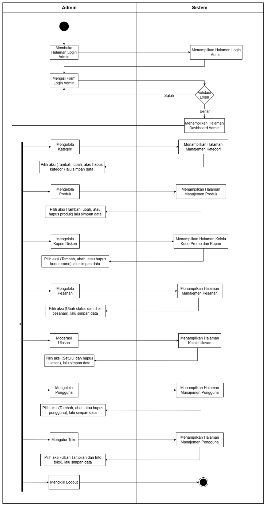

Gambar 3. 5 Activity Diagram Admin

Alur activity diagram Admin dimulai dengan tahap autentikasi, di mana Admin membuka halaman login Admin dan sistem merespons dengan menampilkan halaman login Admin. Admin kemudian mengisi formulir login Admin yang selanjutnya divalidasi oleh sistem melalui proses validasi login. Jika data login salah, alur akan kembali ke proses pengisian formulir login Admin, sedangkan jika benar, sistem akan menampilkan halaman Dashboard Admin. Dari halaman Dashboard Admin, alur diteruskan menuju bilah sinkronisasi (fork) di mana Admin dapat mengakses dan mengelola berbagai fitur secara paralel atau pilihan opsional. Fitur-fitur tersebut meliputi menu Mengelola Kategori, Mengelola Produk, Mengelola Kupon Diskon, Mengelola Pesanan, Moderasi Ulasan, Mengelola Pengguna, dan Mengatur Toko. Pada setiap pilihan menu tersebut, sistem akan menampilkan halaman manajemen terkait agar Admin dapat memilih aksi tambah, ubah, atau hapus data serta menyimpannya kembali ke sistem sebelum alur dikembalikan ke bilah sinkronisasi. Terakhir, Admin dapat mengakhiri sesi pengelolaan dengan memilih aksi mengklik logout dari bilah sinkronisasi, yang kemudian akan diproses oleh sistem menuju status selesai.

##### Activity Diagram Pelanggan

Activity diagram Pelanggan menggambarkan secara komprehensif seluruh alur interaksi dan transaksi yang dapat dilakukan oleh pengguna umum (tamu) maupun pelanggan terdaftar pada website Gegares. Diagram ini mencakup eksplorasi halaman informasi sebelum login, proses pendaftaran (registrasi) akun baru, autentikasi masuk (login), hingga siklus transaksi lengkap dari pengelolaan keranjang belanja sampai dengan penyelesaian transaksi pembayaran dan ulasan produk.

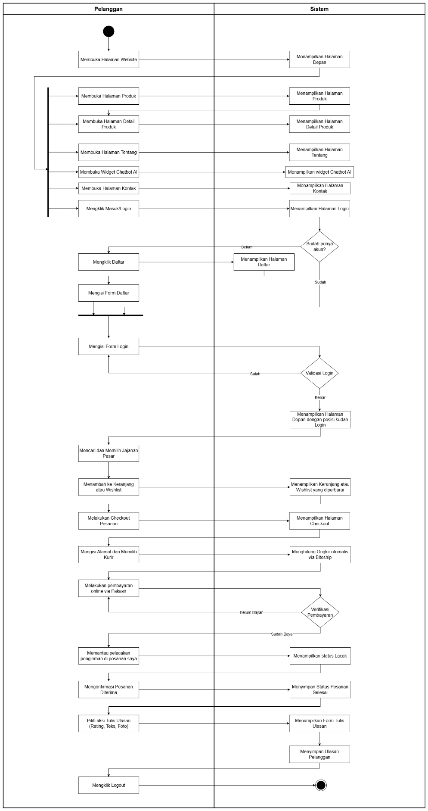

Gambar 3. 6 Activity Diagram Pelanggan

Activity Diagram Pelanggan menggambarkan alur aktivitas yang dilakukan pelanggan saat menggunakan website Gegares, mulai dari mengakses website hingga menyelesaikan transaksi dan memberikan ulasan produk. Proses diawali ketika pelanggan membuka website dan sistem menampilkan halaman beranda. Selanjutnya pelanggan dapat mengakses berbagai halaman seperti produk, detail produk, tentang, kontak, serta menggunakan fitur AI Chatbot untuk memperoleh informasi terkait produk dan layanan. Pada proses penggunaan AI Chatbot, ketika pelanggan mengirimkan pertanyaan teks atau gambar, sistem Laravel terlebih dahulu mengeksekusi kueri database (database query) ke MySQL untuk menarik informasi kontekstual yang relevan (seperti ketersediaan produk, harga, kupon diskon aktif, atau status transaksi pelanggan). Setelah itu, data hasil kueri dikirim bersama pesan pelanggan ke server Gemini AI untuk dirumuskan menjadi jawaban percakapan alami sebelum ditampilkan kembali ke antarmuka obrolan pelanggan. Untuk melakukan pemesanan, pelanggan harus melakukan login terlebih dahulu. Jika belum memiliki akun, pelanggan dapat melakukan registrasi dengan mengisi formulir pendaftaran, kemudian login menggunakan akun yang telah dibuat.

Setelah berhasil login, pelanggan dapat mencari dan memilih produk jajanan pasar yang diinginkan, lalu menambahkannya ke keranjang belanja atau wishlist. Pelanggan kemudian melakukan checkout dengan mengisi alamat pengiriman dan memilih layanan kurir, selanjutnya sistem akan menghitung biaya pengiriman secara otomatis. Setelah itu pelanggan melakukan pembayaran online dan sistem melakukan verifikasi pembayaran. Jika pembayaran berhasil, pelanggan dapat memantau status pengiriman melalui menu pesanan saya hingga pesanan diterima. Setelah pesanan selesai, pelanggan dapat memberikan ulasan berupa rating, komentar, dan foto produk sebagai bentuk penilaian terhadap produk yang telah dibeli. Proses berakhir ketika pelanggan keluar dari sistem melalui fitur logout.

#### Class Diagram

Class diagram merupakan diagram struktur statis yang menggambarkan struktur sistem dengan menunjukkan kelas-kelas, atributnya, serta hubungan keterkaitan antar-kelas. Penerapan class diagram ini bertujuan untuk mendokumentasikan secara rinci arsitektur penyimpanan data, tipe data fisik kolom database, serta relasi kardinalitas (seperti one-to-many dan many-to-many) yang menghubungkan entitas pengguna, produk, kategori, alamat, promo kupon, pesanan, detail pesanan, wishlist, ulasan produk, dan pengaturan toko.

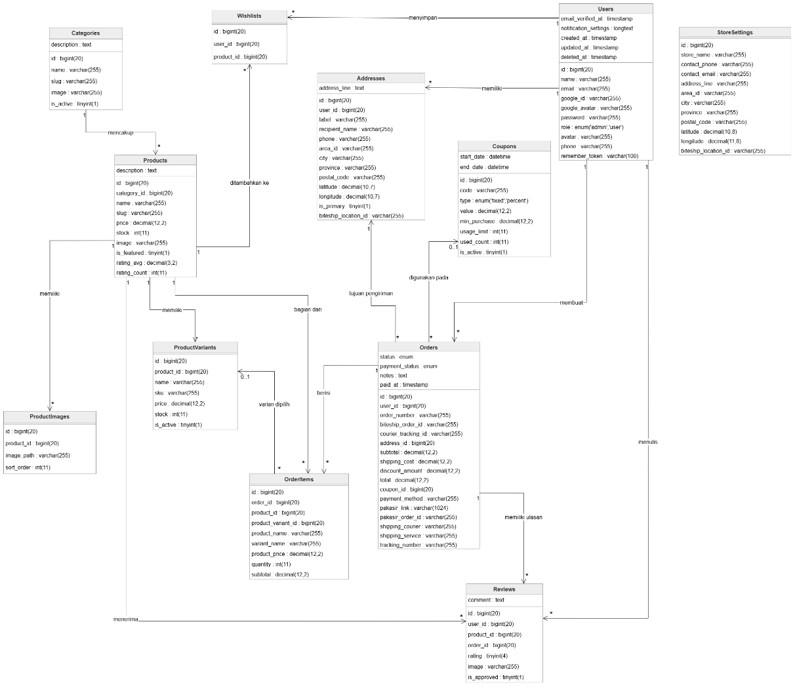

Gambar 3. 7 Class Diagram

Class Diagram digunakan untuk menggambarkan struktur statis sistem yang terdiri dari kelas, atribut, serta hubungan antar kelas yang terdapat pada website Gegares. Pada sistem ini, kelas utama yang digunakan meliputi Users, Products, Categories, ProductVariants, ProductImages, Addresses, Orders, OrderItems, Coupons, Wishlists, Reviews, dan StoreSettings. Kelas Users berperan sebagai penyimpan data pengguna yang memiliki hubungan dengan kelas Addresses, Orders, Wishlists, dan Reviews. Kelas Products menyimpan informasi produk dan berelasi dengan Categories, ProductVariants, ProductImages, OrderItems, Wishlists, serta Reviews. Proses transaksi direpresentasikan oleh kelas Orders yang berhubungan dengan OrderItems, Addresses, Coupons, dan Reviews untuk mencatat data pesanan, detail produk yang dipesan, alamat pengiriman, penggunaan kupon, serta ulasan pelanggan. Selain itu, kelas StoreSettings digunakan untuk menyimpan informasi dan konfigurasi toko yang ditampilkan pada website. Hubungan antar kelas tersebut membentuk struktur data yang saling terintegrasi sehingga mampu mendukung seluruh proses bisnis pada website Gegares, mulai dari pengelolaan produk, pemesanan, pembayaran, pengiriman, hingga pemberian ulasan oleh pelanggan.

### Rancangan Database

Rancangan database (database design) memetakan secara fisik bagaimana data dalam sistem e-commerce Gegares disimpan, diatur, dan saling berhubungan. Sistem ini menggunakan sistem manajemen basis data relasional (RDBMS) MySQL/MariaDB. Berikut adalah penjelasan struktur tabel beserta atribut, tipe data, indeks, dan relasi integritas referensial dari basis data.

1\. Tabel users

Tabel ini digunakan untuk menyimpan seluruh informasi profil pengguna di dalam sistem Gegares, mencakup data kredensial login, nomor telepon, dan status hak akses baik untuk pelanggan (user) maupun administrator (admin). Selain itu, tabel ini juga mendukung integrasi fitur registrasi dan login secara praktis berbasis OAuth Google menggunakan identitas ID Google unik pelanggan.

Tabel 3. 3 Tabel users

| No | Nama Kolom | Tipe Data & Panjang | Key | Keterangan |
| --- | --- | --- | --- | --- |
| 1 | id | bigint(20) unsigned | PK | ID unik berurutan secara otomatis (auto increment). |
| 2 | name | varchar(255) |  | Nama lengkap pengguna. |
| 3 | email | varchar(255) | Unique | Alamat email unik untuk login. |
| 4 | google\_id | varchar(255) | Unique | ID unik dari Google OAuth jika masuk menggunakan Google. |
| 5 | google\_avatar | varchar(255) |  | URL avatar profil dari akun Google. |
| 6 | email\_verified\_at | timestamp |  | Waktu verifikasi email. |
| 7 | password | varchar(255) |  | Password terenkripsi (hashed). |
| 8 | role | enum(‘admin’,‘user’) |  | Hak akses pengguna, default: ‘user’. |
| 9 | avatar | varchar(255) |  | Path file foto profil kustom yang diunggah. |
| 10 | phone | varchar(255) |  | Nomor telepon/WhatsApp. |
| 11 | notification\_settings | longtext (JSON) |  | Konfigurasi preferensi notifikasi pengguna. |
| 12 | remember\_token | varchar(100) |  | Token token pelacak sesi persisten (remember me). |
| 13 | created\_at | timestamp |  | Waktu data baris dibuat. |
| 14 | updated\_at | timestamp |  | Waktu data baris diperbarui. |

2\. Tabel categories

Tabel ini berfungsi untuk mengelompokkan setiap jenis produk jajanan pasar tradisional ke dalam kategori tertentu secara spesifik (seperti Kue Basah, Gorengan, atau Jajanan Kukus). Pengelompokan ini bertujuan untuk mempermudah pelanggan dalam menelusuri katalog jajanan serta memudahkan administrator dalam mengelola keaktifan kelompok produk di dalam sistem.

Tabel 3. 4 Tabel categories

| No | Nama Kolom | Tipe Data & Panjang | Key | Keterangan |
| --- | --- | --- | --- | --- |
| 1 | id | bigint(20) unsigned | PK | ID unik kategori (auto increment). |
| 2 | name | varchar(255) |  | Nama kategori (misal: Kue Basah, Gorengan). |
| 3 | slug | varchar(255) | Unique | Slug nama kategori ramah URL. |
| 4 | image | varchar(255) |  | Path gambar ikon/banner kategori. |
| 5 | description | text |  | Deskripsi singkat mengenai kategori produk. |
| 6 | is\_active | tinyint(1) |  | Status keaktifan kategori (1 = aktif, 0 = nonaktif). |
| 7 | created\_at | timestamp |  | Waktu data dibuat. |
| 8 | updated\_at | timestamp |  | Waktu data diperbarui. |
| 9 | deleted\_at | timestamp |  | Waktu soft delete. |

3\. Tabel products

Tabel ini digunakan untuk menyimpan seluruh data katalog jajanan pasar yang ditawarkan kepada pelanggan, lengkap dengan harga dasar, kapasitas stok fisik, status produk unggulan, dan path gambar utama. Untuk mengoptimalkan kinerja kueri saat memuat data, tabel ini juga menyimpan ringkasan akumulasi rata-rata rating serta total ulasan produk secara instan.

Tabel 3. 5 Tabel products

| No | Nama Kolom | Tipe Data & Panjang | Key | Keterangan |
| --- | --- | --- | --- | --- |
| 1 | id | bigint(20) unsigned | PK | ID unik produk (auto increment). |
| 2 | category\_id | bigint(20) unsigned | FK | Kategori produk (merujuk ke categories.id). |
| 3 | name | varchar(255) |  | Nama produk jajanan pasar. |
| 4 | slug | varchar(255) | Unique | Slug nama produk untuk URL detail. |
| 5 | description | text |  | Penjelasan detail mengenai produk jajanan. |
| 6 | price | decimal(12,2) |  | Harga dasar produk. |
| 7 | stock | int(11) |  | Jumlah stok fisik produk yang tersedia (default: 0). |
| 8 | image | varchar(255) |  | Path file foto utama produk. |
| 9 | is\_featured | tinyint(1) |  | Status rekomendasi halaman utama (1 = unggulan). |
| 10 | rating\_avg | decimal(3,2) |  | Nilai rata-rata rating (default: 0.00). |
| 11 | rating\_count | int(11) |  | Jumlah total ulasan yang masuk (default: 0). |
| 12 | created\_at | timestamp |  | Waktu data dibuat. |
| 13 | updated\_at | timestamp |  | Waktu data diperbarui. |
| 14 | deleted\_at | timestamp |  | Waktu soft delete. |

4\. Tabel product\_images

Tabel ini berfungsi untuk menampung data galeri foto tambahan (multi-gambar) bagi setiap produk jajanan pasar. Dengan adanya tabel ini, satu produk dapat memiliki lebih dari satu gambar visual untuk mempresentasikan produk secara menarik dari berbagai sudut dengan urutan tampilan yang telah ditentukan oleh administrator.

Tabel 3. 6 Tabel product\_images

| No | Nama Kolom | Tipe Data & Panjang | Key | Keterangan |
| --- | --- | --- | --- | --- |
| 1 | id | bigint(20) unsigned | PK | ID unik galeri gambar (auto increment). |
| 2 | product\_id | bigint(20) unsigned | FK | ID produk rujukan (merujuk ke products.id). |
| 3 | image\_path | varchar(255) |  | Path penyimpanan file foto tambahan. |
| 4 | sort\_order | int(11) |  | Urutan tampilan foto (default: 0). |
| 5 | created\_at | timestamp |  | Waktu data dibuat. |
| 6 | updated\_at | timestamp |  | Waktu data diperbarui. |

5\. Tabel product\_variants

Tabel ini dirancang untuk mengakomodasi opsi variasi produk jajanan secara dinamis (seperti perbedaan rasa, ukuran kemasan, atau jenis isian). Adanya tabel ini memungkinkan sistem untuk memisahkan manajemen stok fisik, kode SKU, dan penyesuaian harga khusus dari masing-masing varian secara independen dari harga dasar produk utamanya.

Tabel 3. 7 Tabel product\_variants

| No | Nama Kolom | Tipe Data & Panjang | Key | Keterangan |
| --- | --- | --- | --- | --- |
| 1 | id | bigint(20) unsigned | PK | ID unik varian (auto increment). |
| 2 | product\_id | bigint(20) unsigned | FK | ID produk rujukan (merujuk ke products.id). |
| 3 | name | varchar(255) |  | Nama variasi (misal: “Isi Cokelat”, “Rasa Keju”). |
| 4 | sku | varchar(255) | Unique | Kode SKU unik varian untuk manajemen stok. |
| 5 | price | decimal(12,2) |  | Harga varian (jika berbeda dari harga dasar produk). |
| 6 | stock | int(11) |  | Stok khusus untuk varian ini (default: 0). |
| 7 | is\_active | tinyint(1) |  | Status keaktifan varian (default: 1 = aktif). |
| 8 | created\_at | timestamp |  | Waktu data dibuat. |
| 9 | updated\_at | timestamp |  | Waktu data diperbarui. |
| 10 | deleted\_at | timestamp |  | Waktu soft delete. |

6\. Tabel addresses

Tabel ini berfungsi untuk mencatat data alamat pengiriman lengkap yang didaftarkan oleh pelanggan untuk keperluan distribusi pesanan. Data ini telah terintegrasi dengan kode identifikasi area Biteship API, data kodepos, serta titik koordinat geografis lintang (latitude) dan bujur (longitude) guna mendukung akurasi pencarian lokasi dan perhitungan tarif ongkos kirim otomatis.

Tabel 3. 8 Tabel addresses

| No | Nama Kolom | Tipe Data & Panjang | Key | Keterangan |
| --- | --- | --- | --- | --- |
| 1 | id | bigint(20) unsigned | PK | ID unik alamat (auto increment). |
| 2 | user\_id | bigint(20) unsigned | FK | Pemilik alamat (merujuk ke users.id). |
| 3 | label | varchar(255) |  | Nama label (misal: Rumah, Kantor, Kosan). |
| 4 | recipient\_name | varchar(255) |  | Nama penerima paket di alamat tujuan. |
| 5 | phone | varchar(255) |  | Nomor telepon penerima. |
| 6 | address\_line | text |  | Alamat lengkap (jalan, RT/RW, nomor rumah). |
| 7 | area\_id | varchar(255) |  | ID kode area geografis terstandarisasi. |
| 8 | city | varchar(255) |  | Nama kota / kabupaten. |
| 9 | province | varchar(255) |  | Nama provinsi. |
| 10 | postal\_code | varchar(255) |  | Kode pos. |
| 11 | latitude | decimal(10,7) |  | Koordinat garis lintang peta. |
| 12 | longitude | decimal(10,7) |  | Koordinat garis bujur peta. |
| 13 | is\_primary | tinyint(1) |  | Status alamat utama pengiriman (default: 0). |
| 14 | biteship\_location\_id | varchar(255) |  | ID lokasi Biteship untuk perhitungan ongkir otomatis. |
| 15 | created\_at | timestamp |  | Waktu data dibuat. |
| 16 | updated\_at | timestamp |  | Waktu data diperbarui. |

7\. Tabel coupons

Tabel ini digunakan untuk mencatat dan mengelola data kupon promosi belanja yang diterbitkan oleh pihak toko Gegares untuk menarik minat beli pelanggan. Tabel ini mencakup tipe potongan harga (nominal tetap maupun persentase), batasan minimum transaksi belanja, limitasi pemakaian kupon, serta periode masa berlaku promo.

Tabel 3. 9 Tabel coupons

| No | Nama Kolom | Tipe Data & Panjang | Key | Keterangan |
| --- | --- | --- | --- | --- |
| 1 | id | bigint(20) unsigned | PK | ID unik kupon (auto increment). |
| 2 | code | varchar(255) | Unique | Kode unik kupon diskon (misal: FREEONGKIR). |
| 3 | type | enum(‘fixed’,‘percent’) |  | Jenis potongan (nominal tetap atau persentase). |
| 4 | value | decimal(12,2) |  | Nominal potongan diskon. |
| 5 | min\_purchase | decimal(12,2) |  | Batas minimum pembelian sebelum diskon berlaku. |
| 6 | start\_date | datetime |  | Waktu mulai berlakunya kupon. |
| 7 | end\_date | datetime |  | Batas waktu kedaluwarsa kupon. |
| 8 | usage\_limit | int(11) |  | Kuota maksimum pemakaian kupon. |
| 9 | used\_count | int(11) |  | Total frekuensi pemakaian kupon saat ini (default: 0). |
| 10 | is\_active | tinyint(1) |  | Status keaktifan kupon (default: 1 = aktif). |
| 11 | created\_at | timestamp |  | Waktu data dibuat. |
| 12 | updated\_at | timestamp |  | Waktu data diperbarui. |
| 13 | deleted\_at | timestamp |  | Waktu soft delete. |

8\. Tabel orders

Tabel ini bertindak sebagai entitas transaksi utama yang menyimpan rangkuman nota pembelian pelanggan, merekam biaya subtotal, kupon diskon yang digunakan, tarif ongkos kirim, jenis kurir logistik Biteship, token integrasi gerbang pembayaran Pakasir, catatan tambahan belanja, serta status pelacakan logistik pengiriman dari awal hingga selesai.

Tabel 3. 10 Tabel orders

| No | Nama Kolom | Tipe Data & Panjang | Key | Keterangan |
| --- | --- | --- | --- | --- |
| 1 | id | bigint(20) unsigned | PK | ID unik order (auto increment). |
| 2 | user\_id | bigint(20) unsigned | FK | ID pembeli (merujuk ke users.id). |
| 3 | order\_number | varchar(255) | Unique | Nomor nota transaksi unik (format: GGR-YYYYMMDD-XXXXXX). |
| 4 | biteship\_order\_id | varchar(255) | Index | ID pesanan yang terintegrasi di Biteship. |
| 5 | courier\_tracking\_id | varchar(255) | Index | ID tracking logistik logis di Biteship. |
| 6 | address\_id | bigint(20) unsigned | FK | Alamat pengiriman terpilih (merujuk ke addresses.id). |
| 7 | subtotal | decimal(12,2) |  | Total harga belanja sebelum ongkir & diskon. |
| 8 | shipping\_cost | decimal(12,2) |  | Nominal tarif biaya kirim paket. |
| 9 | discount\_amount | decimal(12,2) |  | Nominal diskon potongan harga dari kupon. |
| 10 | total | decimal(12,2) |  | Total biaya akhir transaksi yang dibayar pelanggan. |
| 11 | status | enum(…) |  | Status pesanan (‘pending’, ‘awaiting\_payment’, ‘paid’, ‘processing’, ‘shipped’, ‘completed’, ‘cancelled’). |
| 12 | coupon\_id | bigint(20) unsigned | FK | ID kupon yang digunakan (merujuk ke coupons.id). |
| 13 | payment\_status | enum(…) |  | Status pembayaran (unpaid, pending, paid, failed, expired). |
| 14 | payment\_method | varchar(255) |  | Jenis metode pembayaran (misal: bank\_transfer, gopay). |
| 15 | pakasir\_link | varchar(1024) |  | Tautan pembayaran Pakasir (hosted payment / QRIS) untuk diarahkan ke halaman bayar. |
| 16 | pakasir\_order\_id | varchar(255) |  | Kode rujukan ID order pada layanan Pakasir. |
| 17 | shipping\_courier | varchar(255) |  | Kode kurir ekspedisi (misal: gojek, grab, jne). |
| 18 | shipping\_service | varchar(255) |  | Jenis layanan kurir (misal: instant, reg). |
| 19 | tracking\_number | varchar(255) |  | Nomor resi pelacakan kurir dari Biteship. |
| 20 | notes | text |  | Catatan tambahan pembeli untuk pesanan. |
| 21 | paid\_at | timestamp |  | Waktu ketika pembayaran berhasil diverifikasi. |
| 22 | created\_at | timestamp |  | Waktu data dibuat. |
| 23 | updated\_at | timestamp |  | Waktu data diperbarui. |
| 24 | deleted\_at | timestamp |  | Waktu soft delete. |

9\. Tabel order\_items

Tabel ini bertindak sebagai tabel detail transaksi yang memetakan relasi antara transaksi pesanan dengan produk beserta variannya. Tabel ini menyimpan catatan historis harga satuan, kuantitas item, subtotal belanja, serta salinan nama produk dan nama varian saat transaksi diselesaikan guna menjaga integritas data laporan keuangan dari perubahan data katalog di masa depan.

Tabel 3. 11 Tabel order\_items

| No | Nama Kolom | Tipe Data & Panjang | Key | Keterangan |
| --- | --- | --- | --- | --- |
| 1 | id | bigint(20) unsigned | PK | ID detail order item (auto increment). |
| 2 | order\_id | bigint(20) unsigned | FK | ID transaksi induk (merujuk ke orders.id). |
| 3 | product\_id | bigint(20) unsigned | FK | ID produk rujukan (merujuk ke products.id). |
| 4 | product\_variant\_id | bigint(20) unsigned | FK | ID varian produk rujukan jika ada. |
| 5 | product\_name | varchar(255) |  | Nama asli produk pada saat dibeli. |
| 6 | variant\_name | varchar(255) |  | Nama asli varian produk pada saat dibeli. |
| 7 | product\_price | decimal(12,2) |  | Harga produk/varian saat transaksi terjadi. |
| 8 | quantity | int(11) |  | Jumlah kuantitas produk yang dibeli. |
| 9 | subtotal | decimal(12,2) |  | Total harga item (product\_price \* quantity). |
| 10 | created\_at | timestamp |  | Waktu data dibuat. |
| 11 | updated\_at | timestamp |  | Waktu data diperbarui. |

10\. Tabel reviews

Tabel ini berfungsi untuk menampung penilaian umpan balik (feedback) dari pelanggan pasca-transaksi pembelian selesai dilakukan. Tabel ini mencatat skor rating kepuasan (skala 1-5), ulasan komentar tertulis, unggahan bukti foto jajanan, serta kolom persetujuan (approval) dari administrator sebagai langkah moderasi ulasan sebelum ditampilkan ke publik.

Tabel 3. 12 Tabel reviews

| No | Nama Kolom | Tipe Data & Panjang | Key | Keterangan |
| --- | --- | --- | --- | --- |
| 1 | id | bigint(20) unsigned | PK | ID unik ulasan (auto increment). |
| 2 | user\_id | bigint(20) unsigned | FK | ID pelanggan penulis ulasan (merujuk ke users.id). |
| 3 | product\_id | bigint(20) unsigned | FK | ID produk yang diulas (merujuk ke products.id). |
| 4 | order\_id | bigint(20) unsigned | FK | ID transaksi pembelian rujukan (merujuk ke orders.id). |
| 5 | rating | tinyint(4) |  | Skor ulasan dari pembeli (skala 1-5). |
| 6 | comment | text |  | Komentar atau ulasan tekstual pengguna. |
| 7 | image | varchar(255) |  | Path foto lampiran ulasan yang diunggah. |
| 8 | is\_approved | tinyint(1) |  | Status moderasi admin (1 = disetujui, default: 0). |
| 9 | created\_at | timestamp |  | Waktu data dibuat. |
| 10 | updated\_at | timestamp |  | Waktu data diperbarui. |
| 11 | deleted\_at | timestamp |  | Waktu soft delete. |

11\. Tabel store\_settings

Tabel ini menyimpan konfigurasi operasional dasar toko e-commerce Gegares dalam bentuk konfigurasi baris tunggal (single row). Informasi penting di dalamnya meliputi detail kontak resmi, alamat fisik toko asal pengiriman barang, titik koordinat geografis toko, serta kode identifikasi lokasi Biteship untuk dihubungkan dengan perhitungan ongkos kirim otomatis.

Tabel 3. 13 Tabel store\_settings

| No | Nama Kolom | Tipe Data & Panjang | Key | Keterangan |
| --- | --- | --- | --- | --- |
| 1 | id | bigint(20) unsigned | PK | ID unik konfigurasi (auto increment). |
| 2 | store\_name | varchar(255) |  | Nama toko (default: “Gegares Ecommerce”). |
| 3 | contact\_phone | varchar(255) |  | Nomor telepon narahubung toko. |
| 4 | contact\_email | varchar(255) |  | Email kontak toko. |
| 5 | address\_line | varchar(255) |  | Alamat fisik lengkap toko. |
| 6 | area\_id | varchar(255) |  | ID area lokasi Biteship untuk alamat asal penjemputan. |
| 7 | city | varchar(255) |  | Nama kota lokasi toko. |
| 8 | province | varchar(255) |  | Nama provinsi lokasi toko. |
| 9 | postal\_code | varchar(255) |  | Kode pos lokasi toko. |
| 10 | latitude | decimal(10,8) |  | Titik lintang GPS lokasi toko. |
| 11 | longitude | decimal(11,8) |  | Titik bujur GPS lokasi toko. |
| 12 | biteship\_location\_id | varchar(255) |  | ID lokasi Biteship asal penjemputan kurir. |
| 13 | created\_at | timestamp |  | Waktu data dibuat. |
| 14 | updated\_at | timestamp |  | Waktu data diperbarui. |

12\. Tabel wishlists

Tabel ini bertindak sebagai tabel persimpangan (junction table) yang menghubungkan entitas pengguna dan produk jajanan pasar. Tabel ini digunakan untuk mencatat daftar produk jajanan yang diminati atau difavoritkan oleh pelanggan agar dapat diakses kembali dengan mudah di lain waktu tanpa harus mencari ulang dari katalog utama.

| No | Nama Kolom | Tipe Data & Panjang | Key | Keterangan |
| --- | --- | --- | --- | --- |
| 1 | id | bigint(20) unsigned | PK | ID unik wishlist (auto increment). |
| 2 | user\_id | bigint(20) unsigned | FK | ID pengguna (merujuk ke users.id). |
| 3 | product\_id | bigint(20) unsigned | FK | ID produk favorit (merujuk ke products.id). |
| 4 | created\_at | timestamp |  | Waktu data dibuat. |
| 5 | updated\_at | timestamp |  | Waktu data diperbarui. |

### Rancangan Tampilan Halaman

Rancangan tampilan halaman dibuat untuk memberikan gambaran antarmuka pengguna pada website Gegares sebelum tahap implementasi dilakukan. Perancangan ini bertujuan agar setiap fitur dapat diakses dengan mudah, memiliki tampilan yang konsisten, serta memberikan pengalaman penggunaan yang nyaman bagi pelanggan maupun admin. Pada bagian ini akan dijelaskan rancangan halaman-halaman yang terdapat pada website Gegares.

#### Rancangan Halaman Pelanggan

Rancangan halaman pelanggan dibuat untuk menggambarkan tampilan dan fitur yang dapat diakses oleh pelanggan pada website Gegares. Halaman ini dirancang agar mudah digunakan, responsif, dan mendukung seluruh proses pemesanan produk secara online.

1.  Rancangan Halaman Login

Rancangan halaman pelanggan dibuat untuk memberikan gambaran antarmuka yang akan digunakan oleh pelanggan saat mengakses website Gegares. Halaman-halaman yang dirancang mencakup seluruh aktivitas pelanggan, mulai dari proses login, registrasi, melihat produk, melakukan pemesanan, pembayaran, hingga memberikan ulasan produk. Perancangan ini bertujuan untuk memastikan setiap fitur dapat diakses dengan mudah, memiliki tampilan yang konsisten, serta memberikan pengalaman penggunaan yang nyaman dan responsif bagi pelanggan.

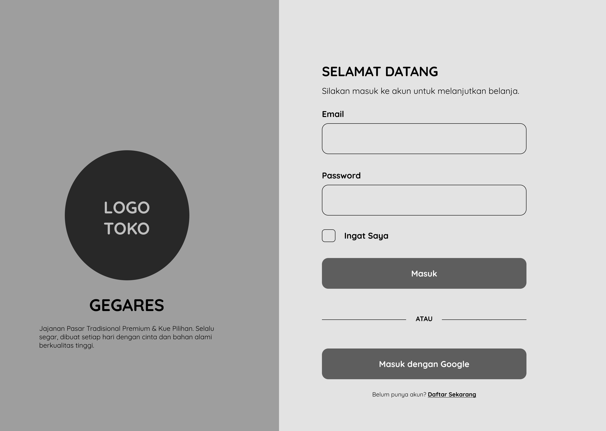

Gambar 3. 8 Rancangan Halaman Login

1.  Rancangan Halaman Daftar

Rancangan halaman daftar digunakan sebagai halaman registrasi bagi pengguna yang belum memiliki akun pada website Gegares. Halaman ini terdiri dari dua bagian utama, yaitu bagian kiri yang menampilkan logo, nama toko, dan deskripsi singkat mengenai Gegares, serta bagian kanan yang berisi formulir pendaftaran akun. Formulir registrasi menyediakan beberapa kolom input, yaitu Nama Lengkap, Email, Nomor WhatsApp, Password, dan Konfirmasi Password yang harus diisi oleh pengguna. Selain itu, tersedia fitur Ingat Saya, tombol Daftar untuk menyelesaikan proses registrasi, serta opsi Daftar dengan Google untuk memudahkan pengguna membuat akun menggunakan akun Google. Pada bagian bawah halaman juga terdapat tautan Masuk Sekarang yang dapat digunakan oleh pengguna yang telah memiliki akun untuk berpindah ke halaman login.

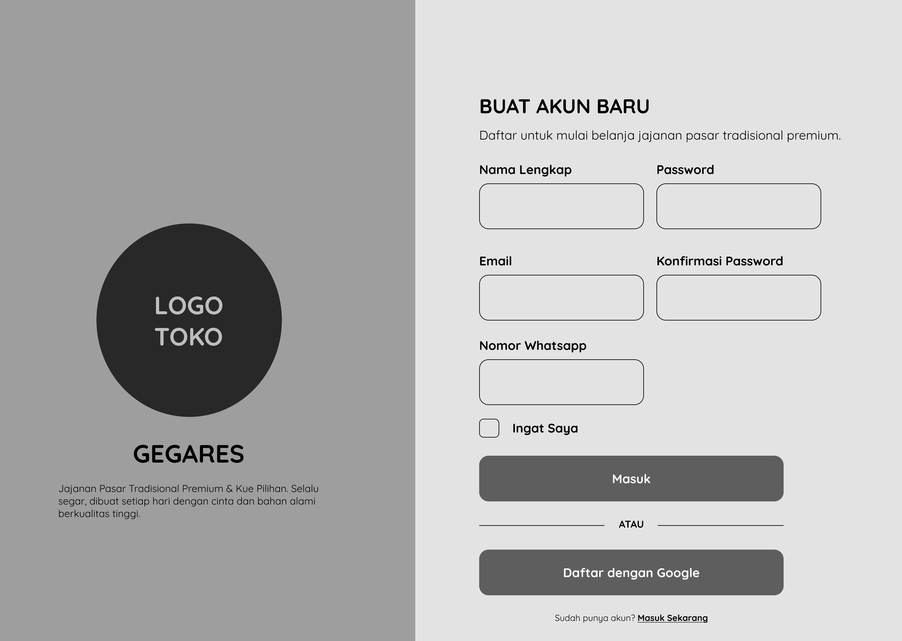

Gambar 3. 9 Rancangan Halaman Daftar

1.  Rancangan Halaman Utama Tanpa Login

Rancangan halaman utama tanpa login merupakan halaman yang ditampilkan saat pengguna pertama kali mengakses website Gegares. Halaman ini terdiri dari navbar, hero section, kategori produk, produk unggulan, FAQ, dan footer. Melalui halaman ini, pengguna dapat melihat informasi toko, menjelajahi produk, serta mengakses halaman login dan registrasi sebelum melakukan pemesanan. Desain halaman dibuat sederhana dan informatif untuk memudahkan pengguna mengenal layanan yang tersedia pada website Gegares.

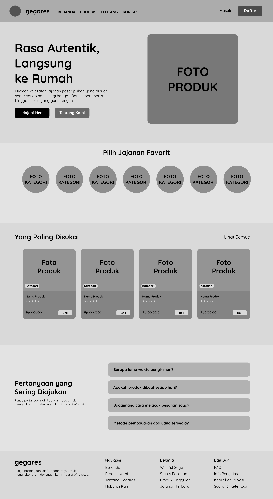

Gambar 3. 10 Rancangan Halaman Utama Tanpa Login

1.  Rancangan Halaman Utama dengan Login